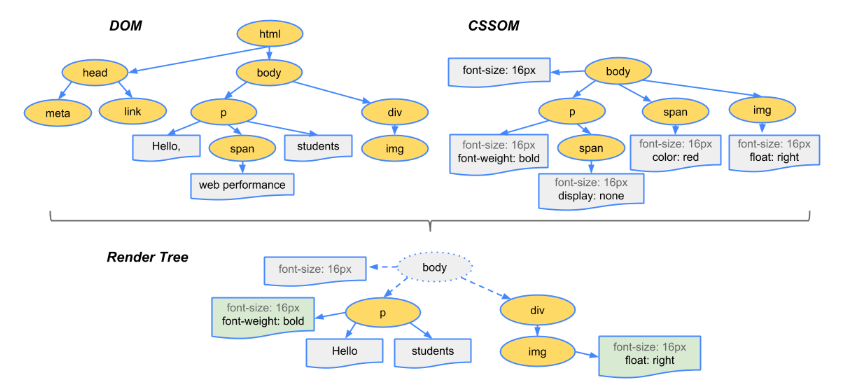
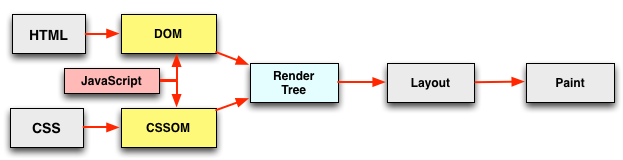
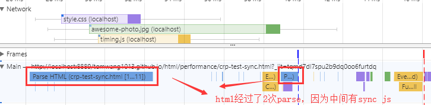
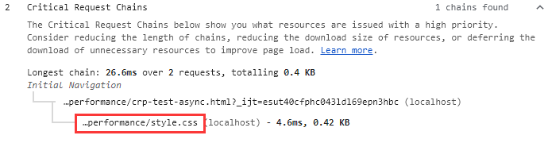
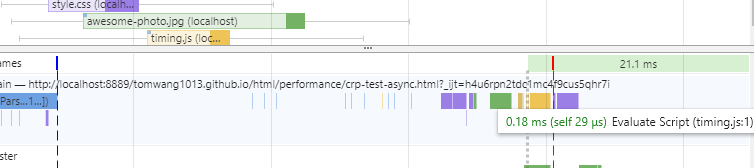

## 深入理解浏览器关键渲染路径(critical render path)及其优化

web性能分析通常都是基本理论+反复实践，没有一套统一的标准或方法。以我的经验来看，我们或多或少都知道一些或几点相关理论，但都是很片段很零碎的，不太好总结或关联起来。本文尝试在`critical render path`(后简称crp)上做一个分析总结。

### 什么是crp？

crp是和浏览器首屏渲染有关的，指的是浏览器在渲染首屏之前需要经过哪些关键步骤。我们知道，首屏渲染速度是性能的一个重要指标，我们应该让用户在打开页面后尽快看到东西出来。要做到这一点，需要深入分析并优化crp，让这些关键步骤所花时间最小。第一步，我们先看看浏览器是如何渲染页面的

### 页面渲染流程

这算是一个基本理论，每个浏览器渲染页面都要经过一个基本相同的过程：


1. 解析html构建DOM
2. 解析css构建CSSOM（和第一步同时进行）
3. 将DOM和CSSOM合起来构建渲染树
4. 根据渲染树，计算每个元素在窗口中的确切位置和大小
5. 执行渲染

我们以一个例子来详细说明这几个步骤，考虑下面一段html：

```html
<!DOCTYPE html>
<html>
  <head>
    <meta name="viewport" content="width=device-width,initial-scale=1">
    <link href="style.css" rel="stylesheet">
    <title>Critical Path</title>
  </head>
  <body>
    <p>Hello <span>web performance</span> students!</p>
    <div></div>
  </body>
</html>
```

第一步解析html，生成DOM：


第二步解析css，生成CSSOM：

DOM告诉了我们页面的结构，但是没有样式信息，所以下一步就是解析css，也会生成一个树状结构，这是因为css具有继承特性，子元素或默认继承父元素的一些样式，我们假设页面中的css如下(可以inline或从外部文件导入)：

```css
body { font-size: 16px }
p { font-weight: bold }
span { color: red }
p span { display: none }
img { float: right }
```

生成的CSSOM树如下：


灰色的`font-size`表示这是一个继承属性。这里需要注意的是，CSSOM树中只包含了我们显式设置样式的元素，因为浏览器还有自己的默认样式

第三步把DOM和CSSOM结合在一起，生成渲染树(render tree)：

渲染树包含所有**可见**的元素及其显式设置的**最终样式(computed style)**，所以head和p元素下面的span不会出现在渲染树中：



<span style="color: #999999;font-size:12px">注：图中的渲染树应该少了一个body的植树span元素</span>

第四步计算所有元素在视窗(viewport)中的位置和大小：

在最终渲染之前需要计算每个元素的位置和大小，即它的`box model`，所有的尺寸css属性都要转为为像素，这一步也叫*回流(reflow)*

最后一步就是渲染(pixel to screen)了，我们知道了元素的可见性及最终样式、大小、尺寸，剩下的事就是将它们画在屏幕上

这就是整个渲染过程，优化crp就是要尽量减少这5步所花的时间，让内容尽快呈现在用户面前。

### css的render blocking特性

从上面我们可以看到，只有html和css都解析完了，我们才能构建渲染树，它们都是*渲染阻塞*(render blocking)的。html不用说了，没有它我们的页面从何而来，我们来说下css。如果没有样式，使用系统默认的样式，页面是很难看且基本不可用的。如果浏览器解析完DOM就直接渲染，等后面css再解析完了再渲染，就会出现页面的闪动问题："Flash of Unstyled Content" (FOUC)，所以我们必须尽快构建CSSOM。因为CSSOM与DOM的构建是并行的，所以一般将css放在head里面，让它尽快开始构建，这样能将渲染树的构建尽量提前。

### javascript登场

页面当然少不了js，关于js的故事也最多。当页面引入js后，问题变复杂了，因为js太强大了：既能修改DOM有能修改CSSOM，还有人人闻之变色敬而远之的`document.write`，所以大家都听到一个故事了：浏览器在parse html过程中只要一遇到js，就要停止parse，直接此js加载并运行完成，这就是**html block on js**。其实这个故事只讲了一半，另一半是**js block on css**：如果当前有css还没有下载或解析完，js必须等待它们完成后才能执行！

前面说过，DOM和CSSOM是并行独立解析的，现在因为js的加入，它们之间发生了关联：DOM解析因js而阻塞，而js又因CSSOM而阻塞：



这也解释了为什么**css在上，js在下(Stylesheets at the top, scripts at the bottom)**：js放在body的末尾，这样就不会对DOM和CSSOM的构建进行干扰，让它们并行尽快完成；放在下面还有一个好处就是不通过`document.ready`事件也能直接引用所有DOM元素。

#### 说说defer和async

前面说的html block on js中的js值的是*sync js*，js可以加上defer或async属性，大家应该都听说过，这里我们详细比较下这2个属性，首先它们有一个共同点：**不会阻塞html的解析**，不同点如下：

- defer js的执行在DOM和**CSSOM**全部构建完之后立即*按顺序执行*，而async js在加载完后马上执行，但是不保证执行顺序
- DOMContentLoaded(DCL)在defer js执行完后再触发，而async js的执行和DCL触发时机无关。使用async js的话，DCL一般在DOM构建完后马上触发

由此可见，如果不考虑js执行顺序，应该优先使用async js

#### 使用chrome devtool中的Audits查看页面crp

我们分别使用sync js，defer js，async js来测试下网页的渲染过程，特别是crp，页面如下：

```html
<!DOCTYPE html>
<html lang="en">
<head>
  <meta charset="UTF-8">
  <meta name="viewport" content="width=device-width,initial-scale=1">
  <title>crp test - async</title>
  <link rel="stylesheet" href="style.css"/>
</head>
<body onload="measureCRP()">
  <p>Hello <span>web performance</span> students!</p>
  <div></div>
    
  <!-- 分别使用defer，async测试 -->
  <script src="timing.js"></script>
</body>
</html>
```

- [sync js(默认行为)](./crp-test-sync.html)：

  

  可以看到js在crp中，且html经过了2次parse，中间被sync js阻塞了：

  

  DCL(蓝线)也在js之后触发

- [defer js](./crp-test-defer.html)

  

  js不在crp中，但是DCL依然在js之后触发：

  

- [async js](./crp-test-async.html)

  

  js不在crp中，和预想的一样，且DCL也在js执行之前触发：

  

  DCL在html parse完之后马上触发了

### 总结

想要提高页面加载和渲染速度，让用户尽快看到内容并交互，必须尽量减少crp的总体时间，控制crp中的资源数量

参考：

https://developers.google.com/web/fundamentals/performance/critical-rendering-path/

https://calendar.perfplanet.com/2012/deciphering-the-critical-rendering-path/