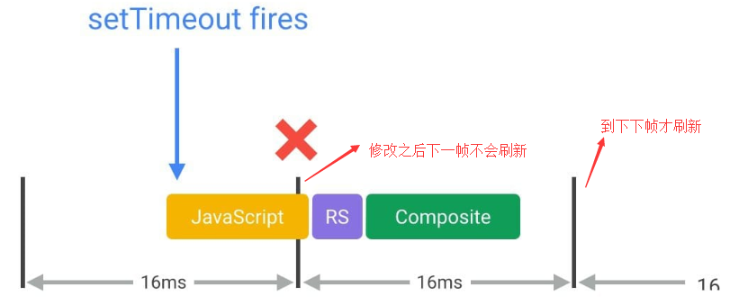

# 浏览器渲染性能分析

这篇文章的主要素材来源于google开发文档：https://developers.google.com/web/fundamentals/performance/rendering/，算是做一个总结再加上自己的一些理解，做一个备忘录

## 概述

显示器是以一个固定速度刷新屏幕的，一般是每秒60帧，我们可以想象浏览器里面有一个保存当前浏览器内容的渲染缓存，有一个独立的线程每隔大约16.6ms从这个缓存中把浏览器内容刷新到屏幕上，而浏览器的渲染便是刷新这个缓存。

浏览器绘制一帧主要需要经过下面5步：


- javascript

  在javascript中可以做一些引起视觉变化的动作，如修改样式、操作dom等

- style

  这一步主要是根据选择器重新计算元素的最终的css样式，看哪些元素的样式发生了变化

- layout

  这个阶段计算元素几何布局的变化，如位置、大小等。值的注意的是，一个元素layout的变化可能会导致其他元素的连锁变化

- paint

  这一步就是绘制了：根据元素的位置、大小、样式进行绘制。一般来说，浏览器是分层(layer)绘制的，不同的元素可能被绘制到不同的层上

- composite

  这一步把绘制好的层根据层级关系(如z-index)组装起来

不是每次重绘(update rendering)都会经过这完整的5步，这又分三种情况：

- 修改layout相关属性，如width，这种情况下需要经过完整的步骤

- 修改的属性和layout无关，如边框颜色，这种情况下不需要重新计算layout，只需要重绘

  

- 有些属性的修改甚至都不需要重绘，直接组装即可

  

  所以做视觉变化时我们应该优先使用这种属性

下面我们依次分析每一步在性能优化时该注意哪些东西

## 优化javascript的执行

### 避免js执行时间太长

提到js渲染优化，大家都知道一点，就是不要让js执行时间过长以免卡住主线程使得页面不能及时渲染更新，因为上面说的那几步都是在主线程中进行的。这个问题除了优化自身代码外有2种解决办法：

- web worker

  比如你要做一个很费时的排序，可以扔给web worker去做，排好序了再返回：

  ```javascript
  var dataSortWorker = new Worker("sort-worker.js");
  dataSortWorker.postMesssage(dataToSort);
  
  // The main thread is now free to continue working on other things...
  
  dataSortWorker.addEventListener('message', function(evt) {
     var sortedData = evt.data;
     // Update data on screen...
  });
  ```

- 任务分解

  如果你的任务实在是要在主线程中做(如需要操作dom)，那么可以把任务分解成很多小步，把每一小步放到`requestAnimationRequest`(简称**raf**，后面会讲到)中进行，这样就不会阻塞页面的响应与渲染，示例如下：

  ```javascript
  var taskList = breakBigTaskIntoMicroTasks(monsterTaskList);
  requestAnimationFrame(processTaskList);
  
  function processTaskList(taskStartTime) {
    var taskFinishTime;
  
    do {
      // Assume the next task is pushed onto a stack.
      var nextTask = taskList.pop();
  
      // Process nextTask.
      processTask(nextTask);
  
      // Go again if there’s enough time to do the next task.
      taskFinishTime = window.performance.now();
    } while (taskFinishTime - taskStartTime < 3);
  
    if (taskList.length > 0)
      requestAnimationFrame(processTaskList);
  }
  ```

### 用requestAnimationRequest来做视觉变化

前面提到了`raf`，这里我们正式介绍一下。简单地说，raf中注册的callback会在每一帧绘制开始的时候被调用。这里的*每一帧开始*可以理解为我们刚开始提到的屏幕以60帧每秒刷新的每一帧的开始，也是上一帧的结束点。就是说，从这个开始点开始，过大约16.6ms，屏幕会再次刷新。所以，你在raf中做的视觉变化(如样式修改，dom操作等)会在下一帧中得到展示(当然这些变化需要在16.6ms之内被浏览器更新)。

在raf出来之前，我们做视觉修改的时机和屏幕刷新时机是完全独立的，这会导致丢帧的情况，就是我我们的修改不会在下一帧显示出来，而是下下帧才显示出来，比如你用`setTimeout`在某个时间点做了修改，可能就会出现这种情形：



如果我们能把js中的视觉修改提前到当前帧的开始处，那就能在下一帧得到展示，而唯一能达到这个目的的做法就是使用raf

## 减少样式计算的作用范围及复杂性

## 避免复杂的布局计算以及布局的反复计算(下面简称布局抖动)

## 简化绘制复杂性及减小绘制区域

## 坚持使用只影响合成的css属性(下面简称"合成相关")及合理使用渲染层

## 考虑在事件处理中使用防抖动机制


