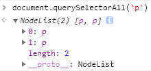

在[custom elment](http://jinge.red/web-componet-custom-element/)中我们提到web component的封装性需要**shadow dom**来进一步提升，因为shadow dom具有两大特点：

- Isolated DOM：隔离的dom结构
- Scoped CSS：作用范围受限的CSS

一句话：custom elements使我们能创建新的html元素，而shadow dom则为新的元素提供内容(html & css)，它们结合在一起使web component(self-contained HTML, CSS, and JavaScript)成为可能

下面我们从基础开始一点点揭开shadow dom的面纱

# 什么是shadow dom？

普通的dom元素可以有自己的子节点，如：

```html
  <div>
    <p>p1</p>
    <p>p2</p>
  </div>
```

这里的`div`元素有两个子元素；除此之外，我们还可以在它上面依附(attach)另一个dom树：

```javascript
const div = document.getElementById('to-attach-shadow');

// attach a shadow dom tree to it
const shadowRoot = div.attachShadow({ mode: 'open' });
shadowRoot.innerHTML = '<p>shadow p1</p><p>shadow p2</p>';
```


依附的这个dom树就是shadow dom，它的根节点叫**shadow root**，而它依附的元素(这里的div)叫**shadow host**：

```javascript
div.shadowRoot === shadowRoot // true
shadowRoot.host === div // true
```


那这里的渲染结果是什么？根据之前custom element中的例子，我们应该才到原来的内容被丢弃了，渲染出来的是shadow dom中的内容：


## Isolated DOM

这里我们通过`document.querySelectorAll`只能得到原来的两个p元素：



shadow dom中的内容没法通过正常途径查询出来，只能通过shadow root来查：


## 不是所有的元素都可以attach shadow dom

有些元素(如：textarea，video等)浏览器已经使用了shadow dom来实现了，你不能再加了；有些元素加shadow dom没有任何意义，如img。所以，只有部分元素可以添加shadow dom，当然这部分元素包含了所有合法的custom elements，参考[attachShadow](https://developer.mozilla.org/en-US/docs/Web/API/Element/attachShadow)查看具体哪些元素可以

# 内容分发与slot

我们把元素原来的子节点dom结构称为**light dom**，前面我们知道，默认情况下light dom是不会渲染出来的，最终的渲染结果完全由其上依附的shadow dom决定。