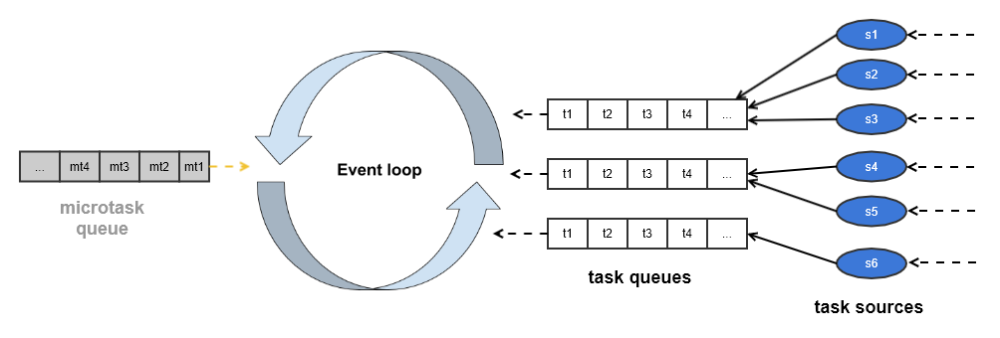

# 深入理解浏览器event loop

## 基本定义

浏览器要做非常多的事情：解析html、渲染、用户交互(如点击)、网络请求等，它使用**event loop**来统一协调这些事务。每个*agent*(如window, web worker, service worker)都有一个event loop。

每个event loop都有一个或多个**task queue**, 它是**task**的集合(set of tasks)。每个task queue和一个或多个**task source**相关联，因为task来自于某个task source。

> Essentially, task sources are used within standards to separate logically-different types of tasks, which a user agent might wish to distinguish between. Task queues are used by user agents to coalesce task sources within a given event loop.

> For example, a user agent could have one task queue for mouse and key events (to which the user interaction task source is associated), and another to which all other task sources are associated. Then, using the freedom granted in the initial step of the event loop processing model, it could give keyboard and mouse events preference over other tasks three-quarters of the time, keeping the interface responsive but not starving other task queues. Note that in this setup, the processing model still enforces that the user agent would never process events from any one task source out of order.

简而言之，事件有很多来源，浏览器根据事件的来源将它们放入不同的处理队列，可以给予队列不同的处理优先级，从而尽可能保证好的用户体验。常见的事件来源有：

- The DOM manipulation task source
  
  This task source is used for features that react to DOM manipulations, such as things that happen in a non-blocking fashion when an element is inserted into the document.

- The user interaction task source

  This task source is used for features that react to user interaction, for example keyboard or mouse input.

- The networking task source
  
  This task source is used for features that trigger in response to network activity

- The history traversal task 
  
  This task source is used to queue calls to history.back() and similar APIs.

每个event loop有一个当前执行任务(**currently running task**)，可能是null。
每个event loop还有一个微任务队列(**microtask queue**)，初始为空。

后面会讲到，microtask和task的区别在于它们执行的时机不同，microtask在当前task执行完之后，并在下一个task执行之前处理。

## 任务入队(Queueing tasks or microtasks)

浏览器主线程(main thread)只是负责不停地从任务队列中取出任务来执行，我们可以假设是其他线程将任务放入队列的。

## 任务执行

总体来说，主线程永不停止地从队列中取出任务并执行，如下所示：

具体来说，每次任务迭代(**event iteration** OR "**frame**")包含如下步骤:

1. 按一定的规则选出一个包含可执行任务的任务队列，我们称之为*taskqueue*
2. 从*taskQueue*中取出第一个可执行任务(*first runnable task*)，我们称之为*oldestTask*，将其移出队列
3. 将当前运行任务(*currently running task*)设为*oldestTask*
4. 将当前时间设置为*taskStartTime*
5. 运行*oldestTask*
6. 将当前运行任务置为null
7. 处理微任务(*microTasks*)，反复执行如下步骤，直到微任务队列(*microTask queue*)为空：

    - 从微任务队列中取出一个任务，设为*oldestMicroTask*
    - 将当前运行任务置为*oldestMicroTask*
    - 运行*oldestMicroTask*
    - 将当前运行任务置为null

8. 将*hasARenderingOpportunity*置为false
9. 将当前时间设为*now*
10. 统计并报过任务执行时间：*taskStartTime*，*now*
11. **更新渲染**：如果当前是一个*window event loop*(worker event loop没有这一步)

    这是很重要的一步，浏览器渲染页面就发生在这一步，即在当前task即所有mircoTask都处理完之后进行渲染更新。但是，更新不是一定会发生，浏览器先要做两个判断：

    1. 当前有没有渲染机会(*rendering opportunity*)
    2. 当前有没有必要进行渲染
    
    如果浏览器判断当前没有渲染机会或者没有必要进行渲染，则不会执行任何渲染动作，页面也不会有任何更新，跳过这一步，直接进入下一步

    关于渲染机会及渲染的必要性，可以参考规范中的两段话：

    >This specification does not mandate any particular model for selecting rendering opportunities. But for example, if the browser is attempting to achieve a 60Hz refresh rate, then rendering opportunities occur at a maximum of every 60th of a second (about 16.7ms). If the browser finds that a browsing context is not able to sustain this rate, it might drop to a more sustainable 30 rendering opportunities per second for that browsing context, rather than occasionally dropping frames. Similarly, if a browsing context is not visible, the user agent might decide to drop that page to a much slower 4 rendering opportunities per second, or even less.

    >The step labeled Rendering opportunities prevents the user agent from updating the rendering when it is unable to present new content to the user (there's no rendering opportunity). The step labeled Unnecessary rendering prevents the user agent from updating the rendering when there's no new content to draw.This step enables the user agent to prevent the steps below from running for other reasons, for example, to ensure certain tasks are executed immediately after each other, with only microtask checkpoints interleaved (and without, e.g., animation frame callbacks interleaved). Concretely, a user agent might wish to coalesce timer callbacks together, with no intermediate rendering updates.

    如果浏览器判断当前有渲染机会，则将*hasARenderingOpportunity*置为true，再进一步，如果当前有必要进行渲染，则执行渲染相关的事情，包含但不限于：

    - 触发窗口的*resize*事件(如果有的话)
    - 触发窗口的*scroll*事件(如果有的话)
    - 执行所有*requestAnimationFrame*的callbacks
    - 更新页面UI的渲染(我们平时所指的*rendering*)

    从这里我们可以看到raf(requestAnimationFrame)的执行时机：它总是在真正的渲染发生之前执行。所以，对页面和dom的改变类的操作尽量放在ref中。
    
    既然event loop的每次任务迭代(task iteration)时渲染不一定会执行，所以ref也不一定会执行。

12. 执行**requestIdleCallback**的callbacks，如果下面所有条件都满足：
    
    - 当前event loop是一个window event loop
    - 任务队列为空
    - 微任务队列为空
    - hasARenderingOpportunity为false

这篇文章本质上是对[规范](https://html.spec.whatwg.org/multipage/webappapis.html#processing-model)的精简解读，规范中还包括大量的作者无法理解的细节，这里都没列出来，有兴趣的读者可以仔细研读一番，定有大的收获。