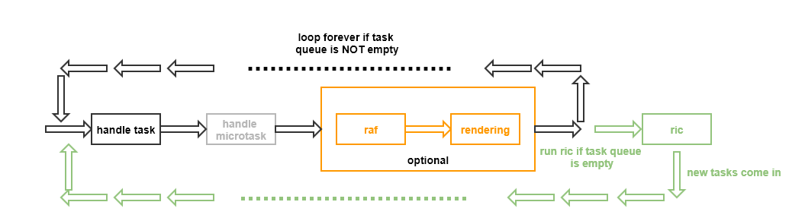

新的html5中有一个以*request*开头的方法：*requestAnimationFrame(raf)*，这个大家都基本用过，至少听过：用于在渲染(rendering, i.e. style recalculation, layout change等)之前做一些事，一般是更新CSS或DOM。

最近又出来两个方法(可能还在提案中)，也是以*request*开头，一个是**rquestIdelCallback**(后面简称*ric*), 一个是**requestPostAnimationFrame**(后面简称*rpaf*)。这里我们就要简单地介绍一下它们：它们的调用时机及主要功能。

在[前一篇](https://tomwang1013.github.io/event-and-drawing/)关于事件循环(event loop)的文章中，其实很我们已经说到了raf和ric的执行时机：



可以看到，ric是在浏览器空闲的时候，即task queue为空的时候执行的，这相当于是安排了一个低优先级的任务。一般来说，不建议在ric中修改css和dom，因为这时候浏览器可能已经做完了rendering，如果在ric中修改css和dom的话，那下一个task处理中对layout的读取(如clientWidth等)将触发强制layout同步([Forced Synchronous Layout](https://developers.google.com/web/fundamentals/performance/rendering/avoid-large-complex-layouts-and-layout-thrashing#avoid-forced-synchronous-layouts))，带来很大的性能问题。前面说过，这些事情应该放在raf中进行。

从名字可以猜到，正如raf是在rendering之前执行，rpaf是在rendering之后执行(post)，并且是**正好**在rendering之后，中间没有任何打扰！

**为什么需要rpaf？** 有两个原因：

1. 更早为下一次页面渲染做准备

   一般来说我们在raf中来更新dom及css来为下一次渲染做准备，但是如果raf中的代码耗时过长，页面可能无法在下一次显卡更新之前(vsync)及时完成渲染并将渲染结果发送到显卡上，毕竟从上图中可以看到，raf的执行时机是在一次事件循环(也叫*frame*)的后期。

   rpaf提供了一种可能，使得我们可以在上一帧渲染完之后马上为下一帧做准备，不会有任何任务来打扰，这样更有可能将渲染结果及时呈现出来

2. 阻止强制layout更新(forced relayout)

   为了保证性能，我们始终要避免编写导致forced layout的代码(即先改变css然后马上读取dom的size)。但是，先阶段浏览器还没有提供一种机制来使得代码在页面完全干净之后运行。下面是一种可能的方法，但是仍然无法百分百保证：

   ```javascript
    addEventListener("message", event => {
      // Query layout information here.
    });

    requestAnimationFrame(() => {
      postMessage("*", "");
    });
   ```

   因为可能还会有其他事件在message事件之前被处理(如timeout，input等)。由于rpaf能保证立即在rendering之后、在所有其他代码之前执行，所以在rpaf中查询dom的size信息，所以这种查询不会引起forced relayout

参考：

https://github.com/WICG/requestPostAnimationFrame/blob/master/explainer.md
https://html.spec.whatwg.org/multipage/webappapis.html#processing-model-8
https://developers.google.com/web/updates/2015/08/using-requestidlecallback
