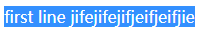

行内布局是css的难点，主要涉及`line-height`，`vertical-align`，`font-size`这几个属性，一个简单的"行内居中对齐"就常常让人抓狂，因为行内不止有文字，还有图片、icon font及`inline-block`元素，它们混在一起会导致各种像素偏差，如果不深入理解其中原理的话，调起来只有碰运气了。还好，已经有前辈帮我们做了很深入浅出的总结，最近又重温了一遍张鑫旭同学的《CSS世界》的第五章：内联元素与流，有了一些新的感悟，特此记录一下

# 几个基础概念

- content area：内容区域

  对文字来说，其选中的背景区域(蓝底白字)可以看成内容区域：

  

  对图片来说，内容区域可以看成是它本身

- inline-box：内联盒子

  内联盒子是行内的一段文字构成的盒子，如果这段文字被内联元素(如`em`,`span`等)包含，就是"内联盒子"，否则就是"匿名内联盒子"

- line-box：行框

  每一行就是就是一个行框，里面有多个内联盒子

- containing box：包含盒子

  包含盒子里面有多个行框

# 行内对齐

我们几乎每天都在做行内对齐，都在用`vertical-align`，但是大家有没有想过：既然是对齐，那肯定有参照物和被参照物，即谁和谁对齐。结合书上的讲解及自己的测试，我得出了下面的结论：

1. 谁和谁对齐？

   指的是内联盒子与行框内的默认基线对齐：每个内联盒子都属于某个行框，而每个行框都有一条默认基线，即行框内匿名内联盒子中x字母的下边沿：

   

2. 如何对齐？

   首先，每个内联盒子都有自己的基线，即每个盒子中字母x的下边沿；行框内所有匿名内联盒子的基线在同一水平线上，我们把这条水平线作为整个行框的默认基线，即上面提到的"默认基线"。

   默认情况下，所有内联盒子的`vertical-align`都是`baseline`，这时的对齐方式是内联盒子的基线和整个行框的"默认基线"对齐：

   

   图中的实线是默认基线，虚线是每个内联盒子的基线


   每个内联盒子可以设置不同的`vertical-align`，这会导致这个盒子在垂直方向上偏离默认基线：

   


   下面举个例子：

   ```html
     <div class="box">
       zyx
       <span class="span1">span1 x</span>
       <span class="span2">x span2</span>
       <span class="span3">x span2</span>
     </div>
   
     <style>
       .box {
         width: 600px;
         background-color: rgb(141, 118, 163);
       }
   
       .span1 {
         font-size: 20px;
         background-color: brown
       }
   
       .span2 {
         font-size: 40px;
         background-color: blue;
       }
   
       .span3 {
         font-size: 60px;
         background-color: yellowgreen;
       }
     </style>
   ```

   默认情况下内联盒子都是按基线(baseline)对齐的：

   

   可以看到它们确实是按基线对齐的。现在我们来调整一下它们的"对齐线"：

   ```css
   .span1 {
     vertical-align: -10px;
   }
   
   .span2 {
     vertical-align: 10px;
   }
   
   .span3 {
     vertical-align: -20px;
   }
   ```

   效果如下，都相对默认基线偏移了设置的值，正值往上偏移，负值往下偏移：

   

   上面提到的是`vertical-align`设置成数值的效果，我们还可以使用关键字top，middle，bottom等。top和bottom比较好理解，它们会导致内连盒子的上边沿或下边沿和整个行框的上边沿或下边沿对齐，这2个值和baseline没啥关系。下面我们说下middle，首先是MDN上的正式定义：

   > middle:
   >
   > ​	Aligns the middle of the element with the baseline plus half the x-height of the parent

   可以看到，middle使得内联盒子的垂直中点和整个行框的默认基线以上1/2个x字母的高度位置对齐，也就是和行框中匿名盒子中x字母的交叉点对齐：

   

   图中span1的高度是40px，它的中线穿过外面x字母的交叉点

3. 其他vertical-align值

   - 百分比

     和数值意思一样，但是需要和line-height的值相乘得到一个具体px数值

   - text-top

     Aligns the top of the element with the top of the parent element's font

   - text-bottom

     Aligns the bottom of the element with the bottom of the parent element's font

   用得不多，但是从字面意思应该不难理解