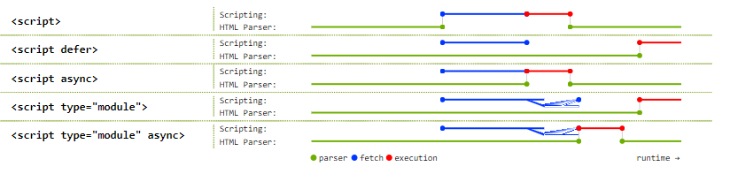

作为前端工程师，我们基本都被`webpack`和`babel`蹂躏过，并且将继续被蹂躏。**module javascript**(下面简称mjs)带来了一点点曙光，本文简单介绍一下mjs

# 基本用法

我们知道，一个js模块是封闭的：它里面定义的所有顶层变量的作用范围都是在模块之内；它对外的接口需要手动导出(export)，模块是我们写代码的正确姿势。但是普通的js文件被浏览器引入之后它里面的代码都是在全局作用域运行的，这才导致了各种模块加载方式的出现，如commonJS，AMD, es6 Module等。

mjs指的是在浏览器端可以直接引用es6 module模块，和普通的js一样，可以引入一个文件，也可以直接inline：

```html
<script type="module" src="main.mjs"></script>
<script type="module">
  import foo from './bar.mjs'
  ...
</script>
```

模块文件一般以`mjs`作为后缀，里面可以使用import和export，和平时的写法一样

# mjs和普通js的区别

加上`type="module"`之后，引入的js变成了mjs，它和普通的js有很多区别：

1. mjs默认使用`strict mode`

2. mjs中定义的顶层变量不再是全局变量

3. 新的import和export语法只能在mjs中使用，不能再普通js中使用

4. 不管被加载多少次，同一个mjs只执行一次；而普通的js每次加载都会执行

5. mjs通过CORS的方式加载，需要服务端的配合；而普通js直接可以跨域加载

6. mjs默认是defer，而普通js需要指定defer属性

7. inline mjs默认也是defer，而普通inline js无法defer

8. inline mjs可以设置async属性，而普通inline js无法async

   这里有张经典的图可以说明上面几条性质：

   

## 其他注意点

1. mjs文件的路径(import * from **modulePath**)的限制：

   ```javascript
   // Not supported (yet):
   import {shout} from 'jquery';
   import {shout} from 'lib.mjs';
   import {shout} from 'modules/lib.mjs';
   ```

   ```javascript
   // Supported:
   import {shout} from './lib.mjs';
   import {shout} from '../lib.mjs';
   import {shout} from '/modules/lib.mjs';
   import {shout} from 'https://simple.example/modules/lib.mjs';
   ```

2. 对于CORS请求，如果是同域的话，需要注意是否发送credentials(cookies, etc)

   大部分和CORS相关的api如果是请求同域的话，默认都会发送credentials的，但是fetch和mjs是个例外，你可能需要设置`crossorigin `才能发送：

   ```javascript
   <!-- Fetched with credentials (cookies etc) -->
   <script src="1.js"></script>
   
   <!-- Fetched without credentials -->
   <script type="module" src="1.mjs"></script>
   
   <!-- Fetched with credentials -->
   <script type="module" crossorigin src="1.mjs?"></script>
   
   <!-- Fetched without credentials -->
   <script type="module" crossorigin src="https://other-origin/1.mjs"></script>
   
   <!-- Fetched with credentials-->
   <script type="module" crossorigin="use-credentials" src="https://other-origin/1.mjs?"></script>
   ```

   但是这个例外未来很可能会变成不例外：

   Both `fetch()` and module scripts will send credentials to same-origin URLs by default. [Issue](https://github.com/whatwg/fetch/pull/585)

3. 要使mjs生效，服务端必须明确在对mjs文件的响应中把`content-type`设置为js格式：推荐为`text/javascript`

# 有了mjs，还需要打包吗？

简单答案是：要

但是mjs提供了一些想象的优化空间，值得注意一下。

TODO


参考文档：

https://developers.google.com/web/fundamentals/primers/modules

https://jakearchibald.com/2017/es-modules-in-browsers/

https://philipwalton.com/articles/deploying-es2015-code-in-production-today/