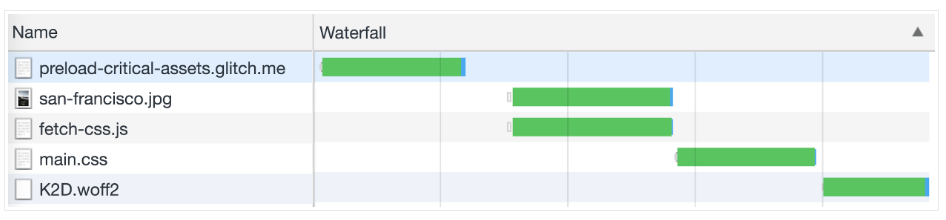
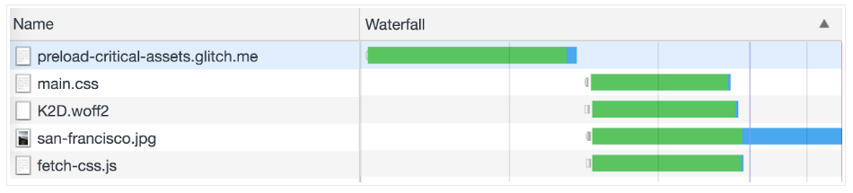
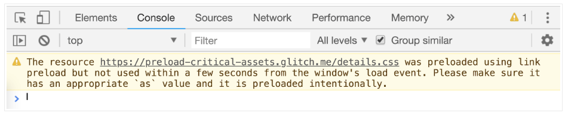

# 概述：提前加载资源，用的时候直接从本地取

对一些资源，如css，js，font，img等，我们可以不必等到**用的时候**再按常规加载，而可以提前加载好(注意：**只是先准备好，并不会马上生效**)，等到需要用的时候直接取就行了，举两个例子：

1. 我们通常把js放在底部：

   ```html
   <body>
     <script src="main.js"></script>
   </body>
   ```

   这样这个js必须等到页面解析完才能被加载并执行。其实我们可以先把这个js下载到本地，等页面解析到这里时直接从本地去，这样就省去了一部分网络加载时间：

   ```html
   <head>
     <link ref="preload" as="script" href="main.js">
   </head>
   <body>
     <script src="main.js"></script>
   </body>
   ```

2. 一些资源是动态加载的，我们可以把这些资源提前加载好，假设页面的管家加载路径如下：

   ```
   ├─┬ / (initial HTML file)  
     └── fetch-css.js
       └── main.css  
         └── K2D.woff2
   ```

   这时网络加载顺序如下：

   

   我们可以把`main.css`和`k2D.woff2`提前加载好：

   ```html
   <head>
     <link rel="preload" href="main.css" as="style">
     <link rel="preload" href="fonts/K2D.woff2" as="font">
   </head>
   ```

   修改之后这两个文件提前加载了：

   

   这样节省了不少时间，提高了首屏渲染速度

# preload vs prefetch

它们的区别就是资源加载的优先级不同：preload的优先级更高，所以它加载的资源一般是本页面要用到的；而prefetch的优先级很低，浏览器只有在空闲的时候才回去加载，它加载的资源一般会在其他页面用到

对于preload，如果加载的资源在一定时间内没有用到(就是没有再去加载)，浏览器就会报出警告：



# 其他注意点

1. cross-origin fetch

   可以设置`crossorigin`属性加载跨域资源：

   ```html
   <link rel="preload" href="other-site/main.css" as="style" crossorigin>
   ```

   字体比较特殊，即使同域也需要加上：

   ```html
   <link rel="preload" href="fonts/K2D.woff2" as="font" crossorigin="anonymous">
   ```

2. 动态加载preload资源

   可以用js来加载preload资源：

   ```javascript
   var preloadLink = document.createElement("link");
   preloadLink.href = "myscript.js";
   preloadLink.rel = "preload";
   preloadLink.as = "script";
   document.head.appendChild(preloadLink);
   ```

   然后像平时一样使用它：

   ```javascript
   var preloadedScript = document.createElement("script");
   preloadedScript.src = "myscript.js";
   document.body.appendChild(preloadedScript);
   ```

3. webpack提供支持

   webpack提供了code splitting的机制，可以让我们动态加载js文件：

   ```javascript
   form.addEventListener("submit", e => {
     e.preventDefault()
     import('lodash.sortby')
       .then(module => module.default)
       .then(sortInput())
       .catch(err => { alert(err) });
   });
   ```

   我们也可以把这个文件preload & prefetch：

   ```javascript
   form.addEventListener("submit", e => {
     e.preventDefault()
     import(/* webpackPrefetch: true */ 'lodash.sortby')
       .then(module => module.default)
       .then(sortInput())
       .catch(err => { alert(err) });
   });
   ```

   

   webpack会自动将prefetch link标签插入到head中

4. 和浏览器内置的preloader的区别

   我们知道浏览器可能有内置的对我们不可见的preloader会提前解析html文件找出需要加载，但是这个机制是没有标准的，每个浏览器都不一样，况且不是所有资源都写在html脚本中的，所以本篇说的preload和这个是完全不同的两件事

# 浏览器支持

目前只有chrome支持，但是其他浏览器都在积极实现中，考虑到chrome No.1的市场地位，值得一试


参考文档：

https://web.dev/fast/preload-critical-assets/codelab-preload-critical-assets

https://developer.mozilla.org/en-US/docs/Web/HTML/Preloading_content