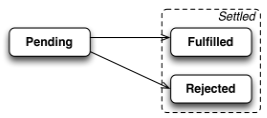
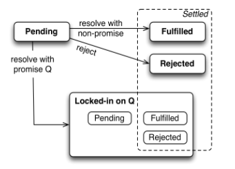

关于promise的教程很多了，个人也看了不少，但心中总是没有一个清晰的脉络，总感觉知识点有点杂乱，希望在这里做个记录，简单清晰全面地总结promise的用法及注意点，不废话不深入，便于查阅

## 创建及使用promise

### 创建

```javascript
const p = new Promise((resolve, reject) => {
    // 此函数立即执行
    ···
    if (···) {
        resolve(value); // success
    } else {
        reject(reason); // failure
    }
});
```

promise创建的时候**立即执行参数函数**

### promise的状态

promise有三种状态：

- Pending：代表初始状态，结果未知
- Resolved：结果成功返回(`resolve`被调用)
- Rejected：计算过程中发生错误(`reject`被调用**或者**参数函数执行过程中有异常抛出`throw`)

如果promise变成Resolved或Rejected，我们称promise已经稳定了(settled)，稳定之后promise的状态不再变化：



### 消费/查询/使用promise

一般都要关心promise的执行结果：

```javascript
// onFulfilled处理resolved通知，onRejected处理rejected通知
promise.then(onFulfilled, onRejected)
promise.then(value => { /* fulfillment */ }, error => { /* rejection */ })

promise.then(null, error => { /* rejection */ });
// 等价于
promise.catch(error => { /* rejection */ });
```

我们可以随时查询promise，无论它当时的状态是否是稳定的

### promise始终是异步的

即使你查询promise的时候promise的状态已经是稳定的，你传递的通知函数也会被异步调用：

```javascript
Promise.resolve(1).then(value => console.log(value))
console.log(2)

// 打印结果：
2
1
```

### 其他创建promise的方法

#### `const p = Promise.resolve(x)`

- x是普通值：p是一个处于Resolved状态且值为x的promise
- x也是通过resolve创建的promise：p = x
- x是其他方式创建的promise：p的状态取决于x的状态，就是说你查询p和查询x是等价的

#### `const p = Promise.reject(error)`

返回一个处于Rejected状态且错误为error的promise：

```javascript
const myError = new Error('Problem!');
Promise.reject(myError).catch(err => console.log(err === myError)); // true
```

## promise链接(Chaining Promises)

promise的一大优点是可以链接，因为`Promise.then`的返回值还是一个promise：

```javascript
const q = p.then(onFulfilled, onRejected) // q is a new promise
```

所以我们可以继续查询q：

```javascript
p
.then(onFulfilled, onRejected)
.then(value => {})	// resolved with what is returned by either onFulfilled or onRejected
.catch(error =>{})	// rejected if either onFulfilled or onRejected throw an exception
```

### 使用普通值来resolve q

```javascript
p
.then(function (value1) {
    return 123;	// q is a promise resolved with 123
})
.then(function (value2) {
    console.log(value2); // 123
});
```

### 使用另一个promise来resolve q

```javascript
p
.then(function (value1) {
    return r;	// r is a promise, q = r
})
.then(function (value2) {
    console.log(value2);
});
```

`resolve promise with normal value or another promise`状态示意图：



### resolve q from `onRejected`

从`onRejected`中返回的值一样可以用来resolve(*不是reject*) q：

```javascript
p
.catch(function () {
    // Something went wrong, use a default value
    return 'Untitled.txt';
})
.then(function (fileName) {
    ···
});
```

### 通过抛出异常来reject q(这个时候没有reject方法可以调用)

```javascript
p
.then(function (value) {
    throw new Error();
})
.catch(function (reason) {
    // Handle error here
});
```

`Promise.prototype.then`的总结：

One of the onFulfilled and onRejected handlers will be executed to handle the current promise's fulfillment or rejection. The call always happens asynchronously, even when the current promise is already settled. The behavior of the returned promise (call it p) depends on the handler's execution result, following a specific set of rules. If the handler function:

- returns a value: p gets fulfilled with the returned value as its value.
- doesn't return anything: p gets fulfilled with undefined as its value.
- throws an error: p gets rejected with the thrown error as its value.
- returns an already fulfilled promise: p gets fulfilled with that promise's value as its value.
- returns an already rejected promise: p gets rejected with that promise's value as its value.
- returns another pending promise: p is pending and becomes fulfilled/rejected with that promise's value as its value immediately after that promise becomes fulfilled/rejected.

### 错误随链接传递直到catch

```javascript
asyncFunc1()
.then(asyncFunc2)
.then(asyncFunc3)
.catch(function (reason) {
    // Something went wrong above
});
```

## 错误处理要点

### 不要使用then方法来捕获错误

```javascript
// Don’t do this
// onRejected能捕获promise抛出的错误，但是不能捕获onFulfilled执行过程中抛出的异常
promise.then(onFulfilled, onRejected)

// 更好的做法
promise.then(onFulfilled).catch(onRejected)
```

### 注意区分reject和throw

一般来说reject抛出的是可预期的操作错误，如文件不存在、网络断开等；而throw抛出的是代码错误，如参数类型错误等

### Promise中抛出的异常不能被try-catch捕获

```javascript
try { 
    Promise.resolve(1).then(a => { throw 'err' }) 
} catch (e) { 
    console.log(222, e) // 无法捕获上面的错误
}
```

## promise组合

### Promise.all([promise1, promise2, ...])

```javascript
Promise.all([
    asyncFunc1(),
    asyncFunc2(),
])
.then(([result1, result2]) => {
    ···
})
.catch(err => {
    // Receives first rejection among the Promises
    ···
});
```

### Promise.race([promise1, promise2, ...])

```javascript
Promise.race([
    httpGet('http://example.com/file.txt'),
    delay(5000).then(function () {
        throw new Error('Timed out')
    });
])
.then(function (text) { ··· })
.catch(function (reason) { ··· });
```

## 两个额外的promise函数

### done()

前面说过promise中抛出的异常外界捕获不到，所以我们解决这个问题(始终加上catch也不行，catch中也可能抛出异常)，可以在promise上定义一个`done`方法，然后跟在promise链最后面：

```javascript
function doSomething() {
    asyncFunc()
    .then(f1)
    .catch(r1)
    .then(f2)
    .done();
}
```

可以这样来定义done方法：

```javascript
Promise.prototype.done = function (onFulfilled, onRejected) {
    this.then(onFulfilled, onRejected)
    .catch(function (reason) {
        // Throw an exception globally
        setTimeout(() => { throw reason }, 0);
    });
};
```

### finally()

仿造`try-catch-finally`我们可以在promise上定义一个finally方法，使得无论最后promise状态如何，始终执行一个callback：

```javascript
Promise.prototype.finally = function (callback) {
    const P = this.constructor;
    // We don’t invoke the callback in here,
    // because we want then() to handle its exceptions
    return this.then(
        // Callback fulfills => continue with receiver’s fulfillment or rejection
        // Callback rejects => pass on that rejection (then() has no 2nd parameter!)
        value  => P.resolve(callback()).then(() => value),
        reason => P.resolve(callback()).then(() => { throw reason })
    );
};
```

Notably, like JS finally clause:

- no value or reason is passed in to the finally code (i.e. to callback).
- Does not affect the result, i.e. the resulting promise is still fulfilled with value or rejected with reason, just like the original one, unless...
- If the finally code blows up (i.e. if callback throws, or returns a rejected promise), it propagates that failure onward, instead of the original success or failure.

#### 更新

最新的Promise规范已经包含这个方法了：[Promise.finally](https://developer.mozilla.org/en-US/docs/Web/JavaScript/Reference/Global_Objects/Promise/finally)

## async & await

async & await本质上是promise的语法糖，掌握了promise基本知道它们的用法了，这个需要注意的是**async函数始终返回一个promise**：

```javascript
async function asyncFunc() {
    return 123;
}

// 等价于：

function asyncFunc() {
    return Promise.resolve(123);
}

asyncFunc().then(x => console.log(x)); // 123

//////////////////////////////////////////////////////////////////

async function asyncFunc() {
    throw new Error('Problem!');
}

// 等价于：

function asyncFunc() {
    return Promise.reject(new Error('Problem!'));
}

asyncFunc().catch(err => console.log(err)); // Error: Problem!

/////////////////////////////////////////////////////////////////

// async可可以直接返回另一个promise
async function asyncFunc() {
    return Promise.resolve(123);
}
asyncFunc().then(x => console.log(x)) // 123

async function asyncFunc() {
    return Promise.reject(new Error('Problem!'));
}
asyncFunc().catch(err => console.error(err)); // Error: Problem!
```

```javascript
async function asyncFunc() {
    const result = await otherAsyncFunc();
    console.log(result);
}

// 等价于:

function asyncFunc() {
    return otherAsyncFunc()
    .then(result => {
        console.log(result);
    });
}
```

```javascript
async function asyncFunc() {
    const result1 = await otherAsyncFunc1();
    console.log(result1);
    const result2 = await otherAsyncFunc2();
    console.log(result2);
}

// 等价于:

function asyncFunc() {
    return otherAsyncFunc1()
    .then(result1 => {
        console.log(result1);
        return otherAsyncFunc2();
    })
    .then(result2 => {
        console.log(result2);
    });
}
```

```javascript
async function asyncFunc() {
    const [result1, result2] = await Promise.all([
        otherAsyncFunc1(),
        otherAsyncFunc2(),
    ]);
    console.log(result1, result2);
}

// 等价于:

function asyncFunc() {
    return Promise.all([
        otherAsyncFunc1(),
        otherAsyncFunc2(),
    ])
    .then([result1, result2] => {
        console.log(result1, result2);
    });
}
```

```javascript
async function asyncFunc() {
    try {
        // 当otherAsyncFunc reject时await语句会抛出异常
        await otherAsyncFunc();
    } catch (err) {
        console.error(err);
    }
}

// 等价于:

function asyncFunc() {
    return otherAsyncFunc()
    .catch(err => {
        console.error(err);
    });
}
```

注意：一个async函数asyncFunc有下面4种调用方法：

- asyncFunc()
- await asyncFunc()
- return asyncFunc()
- return await asyncFunc()

它们的意义各不相同，参考下面的博文

参考：

http://exploringjs.com/es6/ch_promises.html

http://exploringjs.com/es2016-es2017/ch_async-functions.html

https://jakearchibald.com/2017/await-vs-return-vs-return-await/

https://developer.mozilla.org/en-US/docs/Web/JavaScript/Reference/Global_Objects/Promise/then