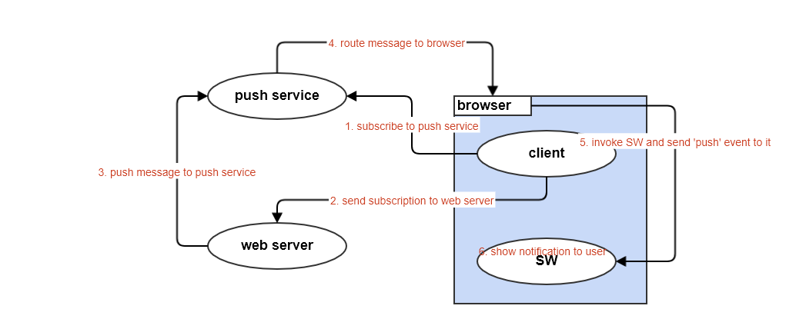
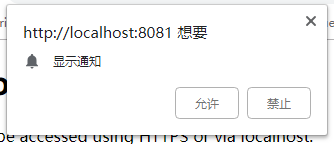
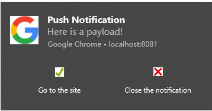
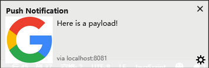

push notification是PWA的重要组成部分，它使得web程序也具有native app类似的"离线"通知功能：即使程序的页面被关掉了，用户依然可以收到服务端发送的通知消息。push notification机制建立在service worker之上，是以下几个部分共同作用的结果：

- **web server**

  后端服务，将消息推送给push service

- **push service**

  和browser相关联的专门用来处理通知的服务，用来接受web server推送的消息。每个浏览器都有自己的push service

- **browser**

  浏览器，除了常规功能之外(毕竟离开浏览器什么都干不了)，它负责和push service通信，并在有消息时唤醒SW

- **client**

  web客户端代码，用来注册(register)SW

- **SW**

  service worker，最终由它来接受消息并展示给用户

要完成消息推送并展示，需要经过下面几个步骤：

1. client注册SW并向push service发起消息订阅请求，并将订阅信息(**subscription**)保存起来
2. web server从client处拿到subscription
3. web server向subscription中的目的地(**endpoint**，其中包含了push service的地址)发送消息
4. push service收到消息，转发给browser
5. browser唤醒SW，将消息发给它
6. SW收到消息，展示出来

整个过程图示如下：



下面进入show me the code阶段，分步讲解每个步骤：

## client订阅消息

- 获得通知权限

  要展示通知，首先我们需要获取系统通知权限，如果用户不允许通知，后面一切都没有意义：

  ```javascript
  // main.js
  Notification.requestPermission(status => {
    console.log('Notification permission status:', status);
  });
  ```

  运行之后会弹出一个框，让用户选择：

  

  用户的选择结果会保存在`Notification.permission`中，值为"granted"或"denied"

- 注册SW

  订阅之前先要注册SW，因为所有的操作都是通过SW进行的，注册之后把注册对象保存起来

  ```javascript
  // main.js
  window.addEventListener('load', () => {      
    navigator.serviceWorker.register('sw.js').then(swReg => {
      console.log('Service Worker is registered', swReg);
      swRegistration = swReg;
    }).catch(err => {
      console.error('Service Worker Error', err);
    });
  });
  ```

- 向push service发起消息订阅请求

  ```javascript
  swRegistration.pushManager.subscribe({
    userVisibleOnly: true,
  }).then(subscription => {
    console.log('User is subscribed:', subscription);
    // 将subscription保存起来发给web server
  }).catch(err => {
    if (Notification.permission === 'denied') {
      console.warn('Permission for notifications was denied');
    } else {
      console.error('Failed to subscribe the user: ', err);
    }
  });
  ```

  订阅成功之后我们得到了订阅信息：subscription，这个信息包含两个关键部分：

  1. web server往哪里发送信息
  2. browser收到push service信息后，唤醒那个SW，即里面包含了SW的标识

  在chrome上示例如下：

  ```json
  { "endpoint": "https://fcm.googleapis.com/fcm/send/cc_aSQO9_gA:APA91bHLpiir8eZqvsMjRULQY16Pv8WXSlStr8G6Lrkyb-Qytxof_r6zZ0jPgViNMTZZgLZ5I4KVjXGiNex-pKnVKckaLdb9wW7_XwZeXT-LQUXHTppHBq7BP428BN_tiriyRRfuelYj", "expirationTime": null, "keys": { "p256dh": "BLy8MEBjYFnwnLH1yiiY9PkWC4o4-pq13G3nSwq8xsCVV_-RhVoPujEndmCwQTXJD32OSekJoHsn-7_eIsH387U", "auth": "_jNmRauTLOXHLbV0Np2v0Q" } }
  ```

  其中的`endpoint`就是web server发送消息的目的地

  可以看到chrome的push service服务运行在`https://fcm.googleapis.com`，每个浏览器都不一样，firefox的是`https://updates.push.services.mozilla.com`， edge的是`https://sg2p.notify.windows.com`

## web server往push service推送消息

web server从client中原封不动拿到subscription，通过一个[Web Push Protocol](https://datatracker.ietf.org/doc/draft-thomson-webpush-protocol/)给push service推送消息，这个协议非常复杂，所以我们一般使用第三方库去做这件事，在nodejs端我们使用[web-push](https://github.com/web-push-libs/web-push)包

因为chrome端发送消息需要使用google的服务，而我们一般用不了， 所以我们以firefox为例。使用web-push库推送消息很简单，基本上只需要上一步的subscription就行了：

```javascript
// node端
const webPush = require('web-push');

// 从client端拿到的subscription
const pushSubscription = { "endpoint": "https://updates.push.services.mozilla.com/wpush/v1/gAAAAABcAN9TNEnJkWUet1JCu0BFE4307sZ1e9RQaxs2x5ReXXcDxU-lRwb9t5B3TWKjSEEmgmJVPjqFDmfWSS2LFiTlynI1T4IVLVyVglR0uM6YYsUa07cUdwnkpwfFLQBCCWjsdgnS", "keys": { "auth": "a-2f-JnVWOWyeic1pJNYNA", "p256dh": "BBgpcZSWJc_VsjQZphdWhADpoDwziiiI3650nG4FrOKrhgWJdMDtWBHDi_BpurksrJc2r-6P2r5BsJBMFGUhuMY" } }

// 要发送的信息
const payload = 'Here is a payload!';

// 发送选项：使用默认值
const options = {}

webPush.sendNotification(
  pushSubscription,
  payload,
  options
).catch(err => {
  console.log('send failed: ', err);
})
```

## SW处理浏览器通知

push service收到消息后，会通知浏览器(如果浏览器当前关闭了，下一次打开时会收到通知)，浏览器唤醒相应的SW，具体就是给SW发送"push"事件，SW处理push事件，并弹个小框将消息展示出来：

```javascript
// sw.js
self.addEventListener('push', event => {
  let body;

  if (event.data) {
    body = event.data.text();
  } else {
    body = 'Default body';
  }

  const options = {
    body: body,
    icon: 'images/notification-flat.png',
    vibrate: [100, 50, 100],
    data: {
      dateOfArrival: Date.now(),
      primaryKey: 1
    },
    actions: [
      {
        action: 'explore', title: 'Go to the site',
        icon: 'images/checkmark.png'
      },
      {
        action: 'close', title: 'Close the notification',
        icon: 'images/xmark.png'
      },
    ]
  };

  event.waitUntil(
    // Show notification
    self.registration.showNotification('Push Notification', options);
  );
});
```

我们通过`showNotification(title, options)`展示通知，第一个参数是标题，第二个参数是一些控制弹窗的选项：

- body：消息内容

- icon：展示在内容旁边的大图标

- vibrate：振动控制

- data

  SW不但可以展示消息，还可以处理用户的点击事件，这个data可以存储一些传递给点击处理的信息

- actions

  在消息弹框上设置一些点击按钮，这样我们可以根据不同的点击做不同的处理

根据上面的设置，在chrome上的效果如下：



而在firefox上actions却没有生效：



可见，每个浏览器的支持还不一样

### 处理用户点击

用户看到通知之后，可以选择关闭弹窗(如果有关闭按钮)或点击上面的任何区域，如果有actions按钮的话还可以点击按钮，点击之后SW会收到`notificationclick`事件：

```javascript
self.addEventListener('notificationclick', event => {
  const notification = event.notification;
  const primaryKey = notification.data.primaryKey;
  const action = event.action;

  if (action !== 'close') {
    event.waitUntil(
      clients.openWindow('samples/page' + primaryKey + '.html')
    );
  }
  
  notification.close();
});
```

如果用户选择关闭消息窗口而不是点击其他区域，SW会收到`notificationclose`事件：

```javascript
self.addEventListener('notificationclose', event => {
  const notification = event.notification;
  const primaryKey = notification.data.primaryKey;

  console.log('Closed notification: ' + primaryKey);
});
```

## VAPID介绍

从前面的流程来看，任何web server只要它拿到了subscription信息都可以向我们push消息，因为push service没法判断谁是合法的pusher，这可能会导致某些安全问题，如DDOS攻击；另外，如果web server在push过程中出问题了，push service也没法和pusher取得联系。所以，我们有必要对web server做标识，区分出合法的pusher，这就是[VAPID(Voluntary Application Server Identification](https://tools.ietf.org/html/draft-ietf-webpush-vapid-01)的来源

具体来说，我们为web server生成一个密匙对，包含公匙和私匙，并加上一个email地址，以便发生问题时push service可以联系server。加上VAPID后，在代码逻辑上需要做一点修改：

- 在client订阅的时候需要加上VAPID中的public key

  ```javascript
  const applicationServerPublicKey = '.........';
  const applicationServerKey = urlB64ToUint8Array(applicationServerPublicKey);
  swRegistration.pushManager.subscribe({
    userVisibleOnly: true,
    applicationServerKey: applicationServerKey
  }).then(subscription => {
    ...
  });
  ```

- server端push消息的时候要加上整个VAPID信息

  ```javascript
  // 密匙对：可以使用web-push生成
  const vapidPublicKey = '...';
  const vapidPrivateKey = '...';
  
  const payload = 'Here is a payload!';
  const options = {
    TTL: 600,
    vapidDetails: {
      subject: 'mailto: ********@***.com',
      publicKey: vapidPublicKey,
      privateKey: vapidPrivateKey
    },
  };
  
  webPush.sendNotification(
    pushSubscription,
    payload,
    options
  )
  ```


更多细节请参考一下文档：

https://developers.google.com/web/ilt/pwa/introduction-to-push-notifications