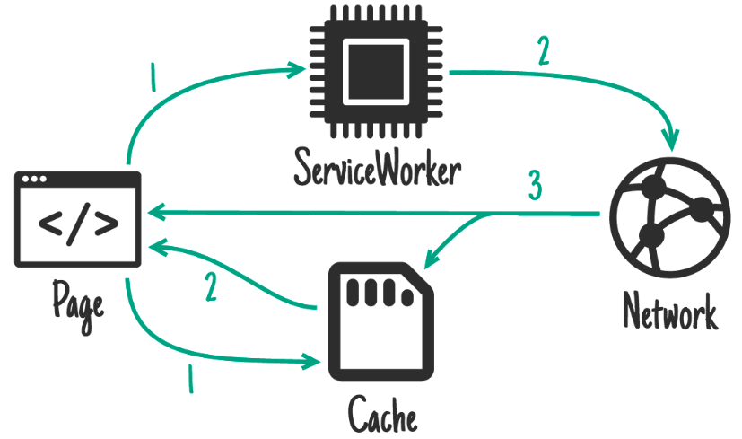
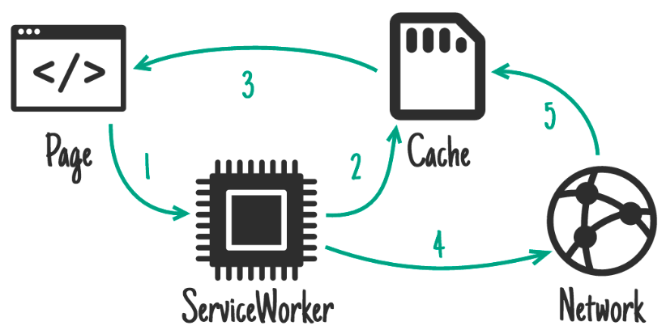

# 详解

PWA中处理请求有很多种模式，比如：

- Cache falling back to network

  先查询缓存，有的话取缓存的数据；没有的话再请求服务端数据

- Network falling back to cache

  和上面一种刚好相反

这是比较常见的两种，还有一种，就是今天我们要介绍的：`cache then network`，什么意思呢？就是同时发请求及查询缓存，如果缓存中有数据的话先用缓存的数据；当请求返回数据后再用返回的数据覆盖。这种方式适合内容更新比较频繁的请求，先让用户尽快看到内容，然后看到最新的内容




代码实现如下：

```javascript
// client.js

var networkDataReceived = false;

startSpinner();

// 1. fetch fresh data
var networkUpdate = fetch('/data.json').then(function(response) {
  return response.json();
}).then(function(data) {
  networkDataReceived = true;
  updatePage(data);
});

// 2. fetch cached data
caches.match('/data.json').then(function(response) {
  if (!response) throw Error("No data");
  return response.json();
}).then(function(data) {
  // don't overwrite newer network data
  if (!networkDataReceived) {
    updatePage(data);
  }
}).catch(function() {
  // we didn't get cached data, the network is our last hope:
  return networkUpdate;
}).catch(showErrorMessage).then(stopSpinner());
```

一般来说缓存中的数据先被取出来展示，网络请求完成后再用最新的数据刷新页面。

这种方式需要sw配合，sw收到fetch时就不能直接读缓存了，需要直接向服务端发起请求，并将返回的数据写入缓存：

```javascript
// sw.js
self.addEventListener('fetch', function(event) {
  event.respondWith(
    caches.open('mysite-dynamic').then(function(cache) {
      return fetch(event.request).then(function(response) {
        cache.put(event.request, response.clone());
        return response;
      });
    })
  );
});
```

大概就这样了，这种模式可能不太常用，但是碰到特殊场景时还是不错的

# 和Stale-while-revalidate的区别

`stale-while-revalidate`是另外一种模式：还是从缓存中取，取完之后再在后台发起一个请求得到最新的数据来刷新缓存，这样可以保持缓存的数据是比较新的(虽然不是最新的)。在这种模式下，客户端不用直接读缓存，一切逻辑都在sw里面：



sw的实现如下：

```javascript
self.addEventListener('fetch', function(event) {
  event.respondWith(
    caches.open('mysite-dynamic').then(function(cache) {
      return cache.match(event.request).then(function(response) {
        // 得到缓存之后发起一个后台请求去拿最新的数据
        var fetchPromise = fetch(event.request).then(function(networkResponse) {
          cache.put(event.request, networkResponse.clone());
          return networkResponse;
        })
        return response || fetchPromise;
      })
    })
  );
});
```

