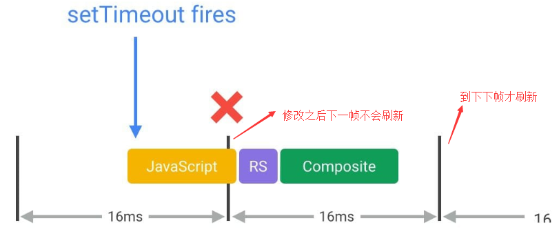
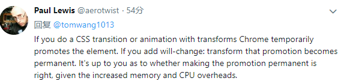

这篇文章的主要素材来源于google开发文档：https://developers.google.com/web/fundamentals/performance/rendering/，算是做一个总结再加上自己的一些理解，做一个备忘录

## 概述

显示器是以一个固定速度刷新屏幕的，一般是每秒60帧，我们可以想象浏览器里面有一个保存当前浏览器内容的渲染缓存，有一个独立的线程每隔大约16.6ms从这个缓存中把浏览器内容刷新到屏幕上，而浏览器的渲染便是刷新这个缓存。

浏览器绘制一帧主要需要经过下面5步：


- javascript

  在javascript中可以做一些引起视觉变化的动作，如修改样式、操作dom等

- style

  这一步主要是根据选择器重新计算元素的最终的css样式，看哪些元素的样式发生了变化

- layout

  这个阶段计算元素几何布局的变化，如位置、大小等。值的注意的是，一个元素layout的变化可能会导致其他元素的连锁变化

- paint

  这一步就是绘制了：根据元素的位置、大小、样式进行绘制。一般来说，浏览器是分层(layer)绘制的，不同的元素可能被绘制到不同的层上

- composite

  这一步把绘制好的层根据层级关系(如z-index)组装起来

不是每次重绘(update rendering)都会经过这完整的5步，这又分三种情况：

- 修改layout相关属性，如width，这种情况下需要经过完整的步骤

- 修改的属性和layout无关，如边框颜色，这种情况下不需要重新计算layout，只需要重绘

  

- 有些属性的修改甚至都不需要重绘，直接组装即可

  

  所以做视觉变化时我们应该优先使用这种属性

下面我们依次分析每一步在性能优化时该注意哪些东西

## 优化javascript的执行

### 避免js执行时间太长

提到js渲染优化，大家都知道一点，就是不要让js执行时间过长以免卡住主线程使得页面不能及时渲染更新，因为上面说的那几步都是在主线程中进行的。这个问题除了优化自身代码外有2种解决办法：

- web worker

  比如你要做一个很费时的排序，可以扔给web worker去做，排好序了再返回：

  ```javascript
  var dataSortWorker = new Worker("sort-worker.js");
  dataSortWorker.postMesssage(dataToSort);
  
  // The main thread is now free to continue working on other things...
  
  dataSortWorker.addEventListener('message', function(evt) {
     var sortedData = evt.data;
     // Update data on screen...
  });
  ```

- 任务分解

  如果你的任务实在是要在主线程中做(如需要操作dom)，那么可以把任务分解成很多小步，把每一小步放到`requestAnimationRequest`(简称**raf**，后面会讲到)中进行，这样就不会阻塞页面的响应与渲染，示例如下：

  ```javascript
  var taskList = breakBigTaskIntoMicroTasks(monsterTaskList);
  requestAnimationFrame(processTaskList);
  
  function processTaskList(taskStartTime) {
    var taskFinishTime;
  
    do {
      // Assume the next task is pushed onto a stack.
      var nextTask = taskList.pop();
  
      // Process nextTask.
      processTask(nextTask);
  
      // Go again if there’s enough time to do the next task.
      taskFinishTime = window.performance.now();
    } while (taskFinishTime - taskStartTime < 3);
  
    if (taskList.length > 0)
      requestAnimationFrame(processTaskList);
  }
  ```

### 用requestAnimationRequest来做视觉变化

前面提到了`raf`，这里我们正式介绍一下。简单地说，raf中注册的callback会在每一帧绘制开始的时候被调用。这里的*每一帧开始*可以理解为我们刚开始提到的屏幕以60帧每秒刷新的每一帧的开始，也是上一帧的结束点。就是说，从这个开始点开始，过大约16.6ms，屏幕会再次刷新。所以，你在raf中做的视觉变化(如样式修改，dom操作等)会在下一帧中得到展示(当然这些变化需要在16.6ms之内被浏览器更新)。

在raf出来之前，我们做视觉修改的时机和屏幕刷新时机是完全独立的，这会导致丢帧的情况，就是我我们的修改不会在下一帧显示出来，而是下下帧才显示出来，比如你用`setTimeout`在某个时间点做了修改，可能就会出现这种情形：



如果我们能把js中的视觉修改提前到当前帧的开始处，那就能在下一帧得到展示，而唯一能达到这个目的的做法就是使用raf

## 减少样式计算的作用范围及复杂性

这一节没啥好说的，一是使用简单的选择器，尽量使用class：

```javascript
// bad
.box:nth-last-child(-n+1) .title {
  /* styles */
}

// good
.final-box-title {
  /* styles */
}
```

二是尽量减少需要重新计算样式的元素数量

## 避免复杂的布局计算以及布局的反复计算(下面简称布局抖动)

- 尽量避免修改元素的布局

  布局计算是重新计算元素的位置及大小，由于元素之间的排版关系紧密，布局计算的范围通常是整个文档：如果文档中的元素很多，这个过程需要花很长时间，所以第一原则是尽量避免修改元素的布局

- 避免强制布局同步(forced synchronous layouts)

  前面提到，一般而言，我们渲染一帧需要经过以下5步：

  

  layout只会计算一次，但是如果我们不注意的话，可能在javascript中就会发生layout计算，这种情况叫*强制布局计算*，也就是通常所说的**回流**。

  关于布局，我们首先要认识的一件事就是在javascript中可以毫无代价地得到前一帧的布局信息，问题在于，如果你在获取之前改变了元素的样式，这个时候浏览器为了得到元素的最新的布局信息，必须先进行布局计算：

  ```javascript
  function logBoxHeight() {
    // 改变元素样式
    box.classList.add('super-big');
  
    // Gets the height of the box in pixels
    // and logs it out - 回流产生
    console.log(box.offsetHeight);
  }
  ```

- 避免布局抖动(layout thrashing)

  比回流更可怕的是反复回流，看下以下代码：

  ```javascript
  function resizeAllParagraphsToMatchBlockWidth() {
    // Puts the browser into a read-write-read-write cycle.
    for (var i = 0; i < paragraphs.length; i++) {
      paragraphs[i].style.width = box.offsetWidth + 'px';
    }
  }
  ```

  每次循环中需要得到box的宽度，同时设置其他元素的宽度；在下一次循环时，由于有元素的样式发生了变化，所以为了得到box的新的宽度必须重新计算布局，导致每次循环都要进行回流，这对性能是影响很大的

## 简化绘制复杂性及减小绘制区域

绘制一般是整个流程中最费时的一步，且除了`transform`和`opacity`属性外(下节会详细讲)，其他css属性的修改都会引起重绘。在重绘不可避免的情况下，可以考虑以下方法来减轻重绘的代价：

- 将重绘的元素提升到新的层

  前面提到过，浏览器是按层绘制的，绘制好所有层之后再把它们叠加合成生成最终的渲染结果。将重绘的元素提升到单独的层，这样就不会影响其他元素，提高渲染效率，这对那种移动的元素尤其有效。提升到独立的层的最有效的办法是使用`will-change`属性：

  ```css
  .moving-element {
    will-change: transform;
  }
  ```

  如果浏览器不支持这个属性，可以使用下面的规则：

  ```css
  .moving-element {
    transform: translateZ(0);
  }
  ```

  当然，太多的层也不好，加了之后需要处理验证

- 减小绘制区域

- 减小绘制复杂性

  不用的css样式效果绘制效率不一样，比如说阴影绘制就比背景耗时，在效果相差不大时尽量考虑使用简单的css样式

## 坚持使用只影响合成的css属性(下面简称"合成相关")及合理使用渲染层

上一节提过，有两个属性的修改不会引起重绘，这2个属性就是 transform 和 opacity：


所以在做动画时使用这2个属性是效率最高的：浏览器会把元素临时提升到独立层，不用绘制，直接合成。注意：如果需要将元素永久性地提升到独立层，需要使用上面提到的`will-change`或`transform`属性：



## 考虑在事件处理中使用防节流机制

- 避免在事件处理中改变样式

  事件处理是在`raf`之前执行的，如果你在事件处理中修改了样式，然后在raf中读取了样式，就可能导致前面提到的回流：

  

  所以始终应该在raf中修改样式

- 事件节流

  想scroll，size这种事件触发频率远远大于屏幕刷新频率的，在这种事件处理中做一些视觉变化操作是很浪费资源的，并可能导致界面卡死，解决办法还是一样：使用raf：

  ```javascript
  function onScroll (evt) {
    // Store the scroll value for laterz.
    lastScrollY = window.scrollY;
  
    // Prevent multiple rAF callbacks.
    if (scheduledAnimationFrame)
      return;
  
    scheduledAnimationFrame = true;
    requestAnimationFrame(readAndUpdatePage);
  }
  
  window.addEventListener('scroll', onScroll);
  ```