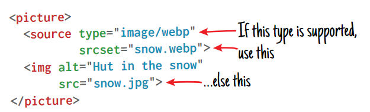

提到响应式图片设计，我们脑海中首先闪现的是`picture`, `source`, `secret`, `sizes`这些新的标签或属性，内容很多，且似乎都不是一看就能明白的道理，关于此方面的文章也多，一般看了过段时间就忘了，今天自己也来总结一下，做个备忘

初衷是这样的：由于设备的多样性，我们希望在不同的设备上，从图片大小和质量上选择最合适的图片！比如说屏幕只有300px，我们肯定不希望加载1000px的原图；比如说在高分辨率的设备上，我们希望提供比普通分辨率上更大的图片。所以我们设置多种条件以及每种条件下的图片，用来**引导浏览器**根据设备的情况和我们设定的条件选择最好的图片。这种选择是浏览器做出的，只要信息足够多，它就能选出最合适的图片

在具体讨论这些新的标签或属性之前，我们先搞清楚几个基本的概念：

- **device pixel radio(dpr)**: 设备像素比

  一个css像素对应多少个设备像素：如果dpr是2，则一个css像素对应2个物理像素

- **image real width**: 图片的真实宽度

  就是图片文件里面记录的图片的真实宽度，单位是*物理px*

- **image display width**: 图片的展示宽度

  就是我们通过css或width属性给图片设置的宽度，单位是*css px*

- **window width**: 浏览器窗口宽度

  就是浏览器viewport的宽度，单位是*css px*

有了这些基础概念，我们再思考一个简单的问题：

> 假设当前设备的dpr是2，一个图片的真实宽度是400px，我们没有给图片设置展示宽度，那么图片的默认展示宽度是多少？

答案是200 (css)px，也就是`物理宽度/dpr`

好了，准备工作差不多了，我们开始讨论具体情况，首先考虑一种最简单最常见的情况：

# fixed size, varying density: 在不同分辨率下展示不同的图片，而图片的展示宽度固定

简单，只需要在img的srcset中指定不同dpr对应的图片url即可：

```html

```

浏览器自动会根据当前dpr去加载对应的图片，如果所有dpr都不匹配，就会取src中的图片。

我们甚至都不需要指定width，只要我们的图片是按dpr等比例设置尺寸的，直接按默认宽度展示即可，因为在任何分辨率下展示的宽度都是一样的

# varying size, varying density：图片的展示大小不固定，分辨率也不固定

如果展示大小不固定，而在图片下载完之前浏览器是无法知道图片的的真实大小的，所以我们可以提供这些信息给浏览器：在srcset中指定图片的真实大小，在sizes指定我们期望图片的展示大小，浏览器会根据这些条件，并考虑当前dpr，去加载最合适的图片，所谓*最合适的图片*，就是尺寸最小的符合展示大小的图片。

举个例子：

假设当前dpr是2，当前窗口大小是700px，我们设置如下img：

```html

```

srcset中的宽度是图片的**真实宽度**，而sizes中的单位都是css像素

由于当前窗口宽度是700，所以满足sizes中的第三个条件：`(min-width: 500) 400px`，这样浏览器认为图片的展示宽度是400px，而当前dpr是2，所以它会去加载真实宽度大于或等于400*2=800的最小的图片，从srcset中我们得知，满足这个条件的最合适的图片是medium.png，所以浏览器只会去加载这张图片

# 更强大的picture

上面提到的sizes中包含了media query，如`(min-width: 1000)`等，但是sizes中能使用的media query是有限制的，比如如果你想实现在横屏竖屏下使用不用的图片，用sizes就没法做，这时我们可以使用更强大的picture元素，它的source子元素可以使用真正的css media query，如：

```html
<figure>
    <picture>
      <source media="(min-width: 750px)"
              srcset="images/horses-1600_large_2x.jpg 2x,
                      images/horses-800_large_1x.jpg" />
      <source media="(min-width: 500px)"
              srcset="images/horses_medium.jpg" />
      
    </picture>
    <figcaption>Horses in Hawaii</figcaption>
</figure>
```

浏览器会找到第一个满足media条件的source，否则使用后面的img元素。source和img中的srcset和sizes和前面将的一样处理，唯一值得注意的是source中不能使用src属性来指定默认图片，但是可以在srcset中指定默认图片

我们还可是使用picture来选择图片格式，如对新的浏览器使用webp等高级图片格式：




参考文档：

https://jakearchibald.com/2015/anatomy-of-responsive-images/

https://developers.google.com/web/ilt/pwa/lab-responsive-images

