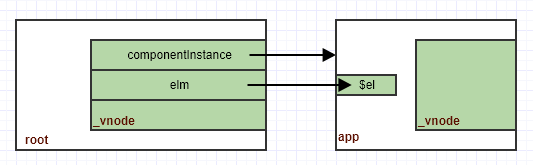
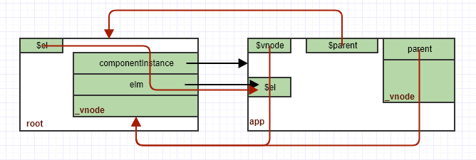
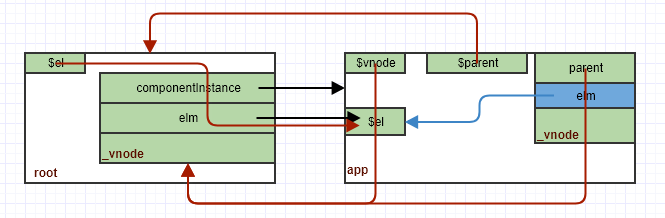

在[上一篇](http://jinge.red/vue-patch-1/)中我们介绍了根组件root的初始化渲染过程：

```javascript
new Vue({
  render: h => h(App),
}).$mount('#app')
```

当时我们提到，root的_vnode的`componentInstance`中存储了App组件的实例(后面称为app)：

```javascript
const child = vnode.componentInstance = createComponentInstanceForVnode(
  vnode,
  activeInstance
)
child.$mount(hydrating ? vnode.elm : undefined, hydrating)
```

在app这个实例mount之后，我们把app.$el插入到页面上整个root就渲染出来了，其中的数据结构如下：



本篇中我们详细看看`app`的创建及首次渲染过程，我们从createComponentInstanceForVnode开始，在本例中，我们传给你它的2个参数依次为`root._vnode`和`root`：

```javascript
export function createComponentInstanceForVnode (
  vnode: any, // we know it's MountedComponentVNode but flow doesn't
  parent: any, // activeInstance in lifecycle state
): Component {
  const options: InternalComponentOptions = {
    _isComponent: true,
    _parentVnode: vnode,
    parent
  }
  
  return new vnode.componentOptions.Ctor(options)
}
```

App的构造函数是`Vue.extend`中定义的，最终会调用`Vue.prototype._init`进行初始化：

```javascript
// src/core/instance/init.js
Vue.prototype._init = function (options?: Object) {
  const vm: Component = this
  vm._uid = uid++
  vm._isVue = true
  
  // merge options
  if (options && options._isComponent) {
    // optimize internal component instantiation
    // since dynamic options merging is pretty slow, and none of the
    // internal component options needs special treatment.
    initInternalComponent(vm, options)
  } else {
    vm.$options = mergeOptions(
      resolveConstructorOptions(vm.constructor),
      options || {},
      vm
    )
  }
  
  vm._renderProxy = vm
  
  // expose real self
  vm._self = vm
  initLifecycle(vm)
  initEvents(vm)
  initRender(vm)
  callHook(vm, 'beforeCreate')
  initInjections(vm) // resolve injections before data/props
  initState(vm)
  initProvide(vm) // resolve provide after data/props
  callHook(vm, 'created')
  
  if (vm.$options.el) {
    vm.$mount(vm.$options.el)
  }
}
```

这个初始化方法主要有三个步骤：

1. 得到vm的最终的$options

   主要是把参数中的options和构造函数的options合并起来作为最终的`$options`，这里我们options._isComponent是true，所以走的是initInternalComponent，这个细节不讨论，有兴趣大家可以看看参考文档(http://hcysun.me/vue-design/art/)

2. 做各种初始化

   有兴趣参考(http://hcysun.me/vue-design/art/)，这里我们只列出一点：在initLifecycle中我们设置了`vm.$parent`及`vm.$root`:

   ```javascript
   // src/core/instance/lifecycle.js
   export function initLifecycle (vm: Component) {
     const options = vm.$options
   
     let parent = options.parent
     if (parent && !options.abstract) {
       ...
       parent.$children.push(vm)
     }
   
     vm.$parent = parent
     vm.$root = parent ? parent.$root : vm
   }
   ```

   我们这里的options里面是传了parent选项的，这里的值是root

3. mount

   这里if条件不成立，所以没有mount，mount发生在实例被创建之后

app创建之后，我们马上进行了mount：

```javascript
child.$mount(hydrating ? vnode.elm : undefined, hydrating)
```

第一个参数是`undefined`，第二个参数是false。我们知道，mount会重新走`_render`及`_update`的过程，我们先看看_render，简化如下：

```javascript
  // src/core/instance/render.js  
  Vue.prototype._render = function (): VNode {
    const vm: Component = this
    const { render, _parentVnode } = vm.$options

    /*if (_parentVnode) {
      vm.$scopedSlots = _parentVnode.data.scopedSlots || emptyObject
    }*/

    // set parent vnode. this allows render functions to have access
    // to the data on the placeholder node.
    vm.$vnode = _parentVnode
    // render self
    let vnode
    vnode = render.call(vm._renderProxy, vm.$createElement)
    
    // set parent
    vnode.parent = _parentVnode
    return vnode
  }
```

在render之前我们设置了实例的`$vnode`属性，render之后又设置了vnode.parent属性，`_render`函数返回的vnode传入`_update`，我们看看update：

```javascript
// src/core/instance/lifecycle.js
Vue.prototype._update = function (vnode: VNode, hydrating?: boolean) {
  const vm: Component = this
  const prevEl = vm.$el
  const prevVnode = vm._vnode
  const prevActiveInstance = activeInstance
  activeInstance = vm
  vm._vnode = vnode
  
  // Vue.prototype.__patch__ is injected in entry points
  // based on the rendering backend used.
  if (!prevVnode) {
    // initial render
    vm.$el = vm.__patch__(vm.$el, vnode, hydrating, false /* removeOnly */)
  } else {
    // updates
  }
  activeInstance = prevActiveInstance
  
  // if parent is an HOC, update its $el as well
  if (vm.$vnode && vm.$parent && vm.$vnode === vm.$parent._vnode) {
    vm.$parent.$el = vm.$el
  }
  // updated hook is called by the scheduler to ensure that children are
  // updated in a parent's updated hook.
}
```

`prevEl`和`prevVnode`分别保存之前的根元素(`$el`)和`_vnode`，在首次渲染之前，它们都是空的。然后设置新的`_vnode`，并在patch之后设置新的`$el`，并且在patch之前修改全局变量`activeInstance`，设置为自己，这里即app实例，patch完之后再还原成root。最后是一个if语句，在本例中是满足的，所以把root的根元素置为和app的一样，所以经过`_render`和`_update`时候数据结构变成：



理解了大概的数据结构之后，我们再详细看看app的render和update过程

# render

App组件的html模板为：

```html
<template>
  <div id="app">
    
    <div>hello, world!</div>
  </div>
</template>
```

它生产的render函数如下：

```javascript
// webpack:///./src/App.vue?5b21
var render = function() {
  var _vm = this
  var _h = _vm.$createElement
  var _c = _vm._self._c || _h
  return _vm._m(0)
}
var staticRenderFns = [
  function() {
    var _vm = this
    var _h = _vm.$createElement
    var _c = _vm._self._c || _h
    return _c("div", { attrs: { id: "app" } }, [
      _c("img", {
        attrs: { alt: "Vue logo", src: require("./assets/logo.png") }
      }),
      _c("div", [_vm._v("hello, world!")])
    ])
  }
]
render._withStripped = true

export { render, staticRenderFns }
```

我们在`_render`中是这么调用的：

```javascript
vnode = render.call(vm._renderProxy, vm.$createElement)
```

`vm._renderProxy`在生产环境下就是vm，`_vm._m`其实就是`staticRenderFns`，`_c`定义如下：

```javascript
vm._c = (a, b, c, d) => createElement(vm, a, b, c, d, false)
```

最终执行的是下面这段代码：

```javascript
    return _c("div", { attrs: { id: "app" } }, [
      _c("img", {
        attrs: { alt: "Vue logo", src: require("./assets/logo.png") }
      }),
      _c("div", [_vm._v("hello, world!")])
    ])
```

最终执行的是`_createElement`：

```javascript
// src/core/vdom/create-element.js
export function _createElement (
  context: Component,
  tag?: string | Class<Component> | Function | Object,
  data?: VNodeData,
  children?: any,
  normalizationType?: number
): VNode | Array<VNode> {
  ...
}
```

对顶层的div来说，传递给这个函数的参数为：

- context：当前实例，即app

- tag："div"

- data：`{ attrs: { id: "app" } }`

- children:

  ```javascript
      [
        _c("img", {
          attrs: { alt: "Vue logo", src: require("./assets/logo.png") }
        }),
        _c("div", [_vm._v("hello, world!")])
      ]
  ```

  其实就是包含2个vnode元素的数组

- normalizationType：undefined

根据这些参数，这个函数的执行路径为：

```javascript
// src/core/vdom/create-element.js
export function _createElement (
  ...
): VNode | Array<VNode> {
  let vnode, ns
  if (typeof tag === 'string') {
    if (config.isReservedTag(tag)) {
      // platform built-in elements
      vnode = new VNode(
        config.parsePlatformTagName(tag), data, children,
        undefined, undefined, context
      )
    } else if (...) {
      ...
    } else {
      ...
    }
  } else {
    ...
  }
  return vnode
}
```

直接是以内置div标签new一个vnode出来

# update

得到这个vnode之后，我们调用patch：

```javascript
vm.__patch__(vm.$el, vnode, hydrating, false /* removeOnly */)
```

这是`vm.$el`是undefined，因为这是首次渲染，我看把视角转向patch函数：

```javascript
  // src/core/vdom/patch.js
  return function patch (oldVnode, vnode, hydrating, removeOnly) {
    let isInitialPatch = false
    const insertedVnodeQueue = []

    if (isUndef(oldVnode)) {
      // empty mount (likely as component), create new root element
      isInitialPatch = true
      createElm(vnode, insertedVnodeQueue)
    } else {
      ...
    }

    return vnode.elm
  }
```

这次很简单，因为`oldVnode`是空的，所以直接调用`createElm`基本就结束了，这次只传了2个参数，我们看看这个函数这次的执行路径：

```javascript
  // src/core/vdom/patch.js
  function createElm (
    vnode,
    insertedVnodeQueue,
    parentElm,
    refElm,
    nested,
    ownerArray,
    index
  ) {
    vnode.isRootInsert = !nested // for transition enter check
    if (createComponent(vnode, insertedVnodeQueue, parentElm, refElm)) {
      return
    }

    const data = vnode.data
    const children = vnode.children
    const tag = vnode.tag
    if (isDef(tag)) {
      vnode.elm = nodeOps.createElement(tag, vnode)
      
      if (__WEEX__) {
        ...
      } else {
        createChildren(vnode, children, insertedVnodeQueue)
        if (isDef(data)) {
          invokeCreateHooks(vnode, insertedVnodeQueue)
        }
      }
    } else if (isTrue(vnode.isComment)) {
      ...
    } else {
      ...
    }
  }
```

这次createComponent是不会返回true的，且调用之后没有任何效果，因为这里的vnode只是一个div的包装而已。代码直接进入第一个if执行下面这行代码：

```javascript
vnode.elm = nodeOps.createElement(tag, vnode)
```

它直接创建一个div元素！因为children还有2个vnode，所以再调用`createChildren`创建子元素，这样app的整个dom就创建好了，然后patch直接返回根元素。最后回到`_update`把这个元素赋给`vm.$el`，整个数据结构变成：



在上一篇我们知道，这个根元素最终会被root插入到文档中从而展示在页面上。至此，下面这两三行简单的代码基本分析完了：

```javascript
import App from './App.vue'
new Vue({
  render: h => h(App),
}).$mount('#app')
```

可以看到，这后面其实牵涉到很多逻辑，何况我们还省略了很多细节，但是更复杂的情况也能从这里推导出来。