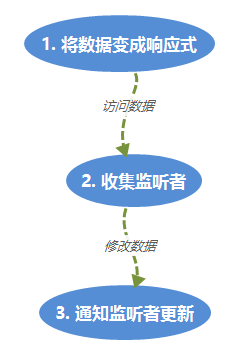
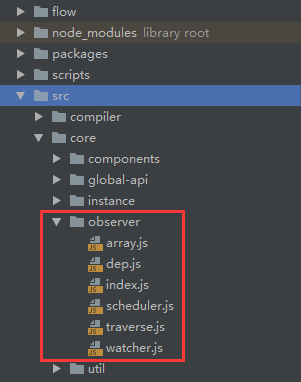
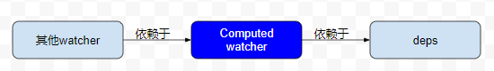

和众多前端框架一样，vue的数据驱动系统是它的核心，很多人都大概知道它是通过`Object.defineProperty`将普通属性变成`get`,`set`实现的，但知道这一点其实没啥用，因为实际情况远比这个复杂、精巧，本文尝试对整个响应式系统做一个简短、清晰、全面而不失深度的总结。以我自己这两年来使用vue的经验，了解这个系统是如何运作的对用好vue是非常有帮助的

# 概述

数据驱动系统用一句话来概括就是：当数据变化时，自动通知监听者(也叫观察者、依赖者等)，这里面有两个主体：一是数据(data)，二是监听者(watcher)。它们两个是多对多的关系：一个数据可以有多个监听者，同时一个监听者可以同时监听多个数据：


既然要通知，就牵涉到两个问题：

- 怎么知道数据变化了？
- 通知谁？

我们先看下第一个问题：怎么知道数据变化了？

这个问题很简单，当我们改变对象某个属性的值，如`obj.foo = 1`时，如果`foo`是一个`setter`属性，那这个赋值操作就会调用setter函数，所以在setter函数中我们就可以知道属性的值变了。所以数据驱动的第一步便是要将数据对象的普通属性转为化`accessor`属性，我们称这一步为**将数据变成响应式**。

再来看第二个问题：数据变化时，通知谁？

很简单：谁依赖于我就通知谁啊。所以问题变成如何收集所有的对此数据的监听者。所谓监听者依赖于数据，指的是监听者在自身的执行过程中**访问了数据**，所以当其所访问的数据发生变化时，我们需要通知他重新执行一下。所以，我们可以在数据被访问的时候(getter)将当前的访问者(假设我们知道)保存起来，然后在数据变化的时候依次通知他们更新, 伪代码如下：

```javascript
let obj = {
  const watchers = []; // 对foo字段的监听者

  get foo() {
    // 假设当前的访问者是currentWatcher
    watchers.push(currentWatcher)
  }，
  
  set foo(newValue) {
    // 数据变化，通知所有监听者更新
    watchers.forEach(w => w.update())
  }
}
```

所以整个数据驱动系统可以用下面的图简单概括：



下面我们依次从源码分析图中的各个步骤是如何实现的。vue中响应式模块的代码如下，后面我们会直接引用文件名而忽略路径信息：



# 将数据变成响应式

要构建响应式数据系统，首先要把数据变成响应式，准确地说是把一个**对象**变成响应式，这样我们就能知道何时访问或修改了这个对象的属性。根据前面的描述，这个过程很简单，就是遍历对象的所有属性，利用`defineProperty`把它们变成`accessor`(getter & setter)，但是需要注意以下几点：

- 对象的每个属性都是单独收集自己的watcher的，所以在遍历的过程中需要为每个属性准备一个专属于它的容器来保存将来要收集的监听者
- 根据情况我们需要深度遍历：属性的值可能也是个对象，我们需要把这个子对象也变成响应式
- 如果这个**对象**是一个数组，我们需要把数组的每个元素变成响应式

根据这几点，我们来看看源码，把对象变成响应式的入口在`index.js`的`observe`中：

```javascript
export function observe (value: any, asRootData: ?boolean): Observer | void {
  ...
  ob = new Observer(value)
  ...
  return ob;
}
```

这个入口函数主要是做了一些判断，看看value能否转成响应式以及是否已经是响应式了，真正的入口是`Observer`这个class的构造函数：

```javascript
// index.js: 省略了一些代码
export class Observer {
  value: any; // 需要转成响应式的对象

  constructor (value: any) {
    this.value = value
    if (Array.isArray(value)) {
      // 如果是数组，把数组的每个元素变成响应式
      this.observeArray(value)
    } else {
      // 如果是普通对象，遍历它的每个属性，将其变成accessor属性
      this.walk(value)
    }
  }

  walk (obj: Object) {
    const keys = Object.keys(obj)
    for (let i = 0; i < keys.length; i++) {
      defineReactive(obj, keys[i])
    }
  }

  observeArray (items: Array<any>) {
    for (let i = 0, l = items.length; i < l; i++) {
      observe(items[i])
    }
  }
}
```

可以看到，真正把对象的某个属性变成`accessor`的是`defineReactive`，对于每个属性，都需要调用一次这个函数：

```javascript
// index.js: 省略部分代码
export function defineReactive (
  obj: Object,
  key: string,
  val: any,
  customSetter?: ?Function,
  shallow?: boolean
) {
  // 这个属性(key)专有的用来收集watcher的容器
  const dep = new Dep()

  // 深度遍历：将所有子对象也变成响应式
  let childOb = !shallow && observe(val)
  
  Object.defineProperty(obj, key, {
    enumerable: true,
    configurable: true,
    get: function reactiveGetter () {
      const value = getter ? getter.call(obj) : val
      // 如果当前存在监听者，将它收集起来
      if (Dep.target/*当前监听者*/) {
        dep.depend() // 收集动作
      }
      return value
    },
    set: function reactiveSetter (newVal) {
      // 如果数据发生变化，通知所有收集到的监听者
      dep.notify()
    }
  })
}
```

这些代码实现完全印证了我们前面的思路：当后面有watcher访问响应式对象的属性时，getter被调用，访问者被对应属性收集

## 扩充及边界：再看Observer

前面我们讲的是主体思想及实现，我们贴的代码也是精简过的，真实实现要比这个复杂一些，有很多边界条件及系统的健壮性可用性需要考虑，考虑以下两个问题：

- 如果一个watcher依赖于对象o的属性a，而a本身是一个对象：

  ```javascript
  let o = {
    a: { b: 2 }
  }
  ```

  按照我们前面贴出的代码，我们直接赋给`o.a`一个新的值是可以触发watcher的更新操作的，但是给`o.a`对象新增或删除一个属性却不会通知watcher：

  ```javascript
  // 可以触发watcher更新
  o.a = { c: 2 } 
  
  // 新增或删除字段都不会触发
  o.a.c = 2
  delete o.b
  ```

  而一般情况下，后面2种操作我们也是需要触发的，所以需要提供给用户某种接口，使得新增或删除字段时也能触发更新

- 如果一个watcher依赖于对象o的属性a，而a本身是一个数组：

  ```javascript
  let o = {
    a: [1, 2]
  }
  ```

  同理，按照我们前面贴出的代码，我们直接赋给`o.a`一个新的值是可以触发watcher的更新操作的，但是给`o.a`对象新增或删除数组元素时却不会触发：

  ```javascript
  // 可以触发watcher更新
  o.a = [3, 4] 
  
  // 新增或删除字段都不会触发
  o.a.splice(0, 1, 10);
  o.a.push(3)
  o.a.pop()
  ...
   
  ```

  而一般情况下，我们是希望触发的，所以vue也需要对数组做些特殊处理，使得我们对数组的改动也能触发watcher的更新

这两种情况，vue作者都做了考虑，答案就在`Observer`中，我们重新看下它的构造函数未贴出的部分：

```javascript
export class Observer {
  dep: Dep; // 收集依赖于整个value对象的watcher

  constructor (value: any) {
    this.dep = new Dep()
    def(value, '__ob__', this)
    
    if (Array.isArray(value)) {
      const augment = hasProto
        ? protoAugment
        : copyAugment
      augment(value, arrayMethods, arrayKeys)
      ...
    } else {
      ...
    }
  }
}
```

这里面有两个重要的变化：

1. Observer对象定义了一个dep字段，我们知道dep对象是用来收集watcher的，但是这里的dep不是和value对象的某个属性绑在一起，而是和整个value相关联，它起的作用正是**收集依赖于整个value对象的所有watcher，当value增加删除字段(如果value是纯对象)或元素(如果value是数组)自动通知watcher更新**。那什么叫*依赖于整个value对象呢*？很简单，就是value作为其他响应式对象的一个属性的值，而watcher依赖于这个属性，如：

   ```javascript
   const o = {
     a: {
       b: 1
     }
   }
   ```

   如果w依赖于`o.a`，那么我们就说w依赖于o.a对应的整个对象：`{ b: 1 }`。假设value = o.a，则经过Observer构造函数后，value的值变成如下：

   ```javascript
   {
       __ob__: { 
         dep // 收集依赖于外层a字段的watcher，即这里的w
         value
       },
       b: {
         dep // 收集依赖于b字段的watcher
         get() { },
         set() { }  
       }  
   }
   ```

2. 对数组的特殊处理

   同理，如果w依赖于一个数组字段value，那么这个数组经过observe之后，`value.__ob__.dep`也会收集这个w：

   ```javascript
   const o = {
     // w依赖于o.a，value = o.a
     a: [1, 2]
   }
   
   // observe(value)之后, value上多了__ob__这个属性：
   {
     __ob__: {
       dep, // 收集依赖于外层a字段的watcher，即这里的w
       value
     }
   }
   
   ```

   此外，我们还需要监听数组元素的变化，即当用户调用push，pop等修改数组的方法时会自动通知watcher，vue实现的原理是改写这些数组方法，并拦截调用，这就是下面这几行代码做的事：

   ```javascript
   const augment = hasProto
           ? protoAugment
           : copyAugment
         augment(value, arrayMethods, arrayKeys)
   ```

讲到这里，我们可以知道，一个对象是否是响应式的，只要看看它有没有`__ob__`属性。另外，有时还需要关注它是否是另一个响应式对象的某个属性的值，即这个对象是不是顶层对象，如果是顶层对象的话，它的`__ob__.dep`中是没有监听者的，vue组件中的`data`对象就是一个顶层对象

# 收集监听者

前面我们反复提到了`Dep`类(上面的dep都是它的实例)就是用来收集watcher的，这节我们仔细看看它和数据及watcher三者的关系，我们先看看较为简单的Dep

## Dep

一个dep从属于某个响应式属性，里面包含了所有依赖于该属性的watcher，它的实现比较简单：

```javascript
export default class Dep {
  static target: ?Watcher; // 当前监听者：任何时刻最多只有一个监听者
  id: number; // dep的唯一标识
  subs: Array<Watcher>; // 收集到的所有watcher

  constructor () {
    this.id = uid++
    this.subs = []
  }

  addSub (sub: Watcher) {
    this.subs.push(sub)
  }

  removeSub (sub: Watcher) {
    remove(this.subs, sub)
  }

  // 收集watcher
  depend () {
    if (Dep.target) {
      // 收集watcher动作：将当前watcher收集起来
      Dep.target.addDep(this)
    }
  }

  // 通知watcher更新
  notify () {
    const subs = this.subs.slice()
    for (let i = 0, l = subs.length; i < l; i++) {
      subs[i].update()
    }
  }
}
```

基本没啥说的，唯一要注意的地方是在`depend`中，我们不是直接调用`addSub`将当前watcher收集起来，而是调用watcher的`addDep`方法，其实`watcher.addDep`内部最终也是调用`dep.addSub(this)`的，只是它还做了一些其他处理，这个我们后面会说。

这里再强调一点：dep和watcher是多对多的关系：


dep需要管理自己的watchers，通过`addSub`和`removeSub`随时更新watchers，但是这两个动作都是由watcher发起的。watcher也需要管理自己当前正在监听的所有数据，即管理和这些数据关联的deps。

## watcher

终于讲到watcher了，我们把数据变成响应式之后，需要访问数据(调用数据属性的getter)才能将当前的访问者收集起来，这个访问动作就是由watcher发起的。简单地说，这个访问动作就是调用一个求值函数。所以构建一个watcher需要至少提供：

- 求值函数
- 回调函数：求值函数返回的值发生变化时回调

另外，任何一个watcher都属于某个vue组件实例，

此外，watcher还需要保存所依赖的所有deps，我们看看简化的源码：

```javascript
// watcher.js
export default class Watcher {
  vm: Component; // 所属的vue实例
  cb: Function; // 当value发生变化时的回调函数
  id: number; // 标识watcher的唯一id

  // 需要维护的依赖集
  deps: Array<Dep>; 
  newDeps: Array<Dep>;
  depIds: SimpleSet;
  newDepIds: SimpleSet;

  getter: Function; // 求值函数
  value: any; // 求值函数返回结果

  constructor (
    vm: Component,
    expOrFn: string | Function,
    cb: Function,
    options?: ?Object,
    isRenderWatcher?: boolean
  ) {
    this.vm = vm
    
    // vm把自己的watchers保存起来
    vm._watchers.push(this)
    
    this.cb = cb
    this.id = ++uid // uid for batching
    
    this.deps = []
    this.newDeps = []
    this.depIds = new Set()
    this.newDepIds = new Set()
    
    // parse expression for getter
    if (typeof expOrFn === 'function') {
      this.getter = expOrFn
    } else {
      this.getter = parsePath(expOrFn)
    }
    
    // 求值：触发收集操作
    this.value = this.get()
  }

  /**
   * Subscriber interface.
   * Will be called when a dependency changes.
   */
  update () {
  }
}
```

精简后的watcher实现应该比较好理解了，`getter`保存了我们的求值函数，构造函数末尾我们通过`watcher.get`函数的调用触发求值函数，从而将watcher收集到所有的求值过程中遇到的dep中：

```javascript
  /**
   * Evaluate the getter, and re-collect dependencies.
   */
  get () {
    pushTarget(this) // 将此watcher设置为当前watcher
    let value
    const vm = this.vm
    // 调用求值函数，启动收集过程
    value = this.getter.call(vm, vm)
    
    popTarget() // 还原当前watcher
    this.cleanupDeps()
    
    return value
  }
```

函数开始我们先将自己设置为当前watcher，然后调用求值函数，启动收集过程，这个过程中每次访问到响应式属性都会触发下面的调用过程：

```
data.getter() => dep.depend() => watcher.addDep() => (可选)dep.addSub()
```

我们来看看`watcher.addDep`，看看为什么不直接在`dep.depend`中调用`dep.addSub`，而需要绕一圈：

```javascript
  /**
   * Add a dependency to this directive.
   */
  addDep (dep: Dep) {
    const id = dep.id
    if (!this.newDepIds.has(id)) {
      this.newDepIds.add(id)
      this.newDeps.push(dep)
      if (!this.depIds.has(id)) {
        dep.addSub(this)
      }
    }
  }
```

在构造函数中我们看到watcher定义了下面四个字段来管理依赖，它们的意义如下：

```javascript
// 保存当前的依赖集   
newDeps: Array<Dep>;
newDepIds: SimpleSet;

// 保存上一次求值时的依赖集
deps: Array<Dep>;
depIds: SimpleSet;
```

为什么要这多呢？其实这是用来避免将一个watcher重复收集在同一个dep中的。假设`getter`函数如下：

```javascript
function fn() {
  return o.a + o.a;
}
```

o.a是一个响应式数据，如果我们不做处理的话，o.a.dep中将包含2个一样的watcher，这是为了在同一次求值过程中避免重复收集依赖；还有一种情况需要考虑：watcher的多次求值，这种情况我们同样需要避免重复收集watcher。所以我们在watcher中不但要保存当前求值正在收集的依赖(newDeps, newDepIds)，还需要保存上一次求值收集的依赖，每次求完值之后，我们会把newDeps赋值给deps，并把newDeps清空，这是通过在求值最后调用cleanupDeps实现的：

```javascript
  cleanupDeps () {
    let i = this.deps.length
    while (i--) {
      const dep = this.deps[i]
      if (!this.newDepIds.has(dep.id)) {
        dep.removeSub(this)
      }
    }
    let tmp = this.depIds
    this.depIds = this.newDepIds
    this.newDepIds = tmp
    this.newDepIds.clear()
    tmp = this.deps
    this.deps = this.newDeps
    this.newDeps = tmp
    this.newDeps.length = 0
  }
```

这个函数的逻辑分成两部分：后面的部分就是newDeps赋值给deps，并把newDeps清空；前一部分是解除废弃的依赖，就是说如果watcher不再依赖于某个数据了，需要把watcher从这个数据的依赖集中去掉：`dep.removeSub`。

### vue中watcher的分类

在watcher的构造函数中，有几个实例属性我们没有讲到，这牵涉到watcher的分类，我们来看看：

```javascript
  // watcher.js
  constructor (
    vm: Component,
    expOrFn: string | Function,
    cb: Function,
    options?: ?Object,
    isRenderWatcher?: boolean
  ) {
    this.vm = vm
    if (isRenderWatcher) {
      vm._watcher = this
    }
    vm._watchers.push(this)
    
    // options
    if (options) {
      this.user = !!options.user
      this.computed = !!options.computed
    } else {
      this.user = this.computed = false
    }
    ...
  }
```

参数`isRenderWatcher`表示watcher是否是渲染watcher，我们知道每个vue实例都有一个渲染函数，它监控实例数据的变化并重新渲染dom，渲染watcher保存在vue实例的`_watcher`中，渲染watcher在src/core/instance/lifecycle.js中创建，大家有兴趣可以看看：

```javascript
// lifecycle.js
export function mountComponent (
  vm: Component,
  el: ?Element,
  hydrating?: boolean
): Component {
  ...
  // we set this to vm._watcher inside the watcher's constructor
  // since the watcher's initial patch may call $forceUpdate (e.g. inside child
  // component's mounted hook), which relies on vm._watcher being already defined
  new Watcher(vm, updateComponent, noop, {
    before () {
      if (vm._isMounted) {
        callHook(vm, 'beforeUpdate')
      }
    }
  }, true /* isRenderWatcher */)
  ...
}
```

另外两个属性`user`和`computed`的意义分别如下：

- user：标识是否是用户定义的watcher，即用户通过`vm.$watch`函数或watch选项定义的watcher
- computed：标识是否是计算属性watcher，即系统自动为计算属性创建的watcher，它监听计算属性所依赖的数据的变化并更新计算属性的值

## 再看getter

看了dep和watcher的实现，我们对依赖收集的整个过程应该比较清楚了，下面我们再看看getter中省略的部分：

```javascript
export function defineReactive (
  obj: Object,
  key: string,
  val: any,
  customSetter?: ?Function,
  shallow?: boolean
) {
  const dep = new Dep()

  ...

  let childOb = !shallow && observe(val)
  Object.defineProperty(obj, key, {
    enumerable: true,
    configurable: true,
    get: function reactiveGetter () {
      const value = getter ? getter.call(obj) : val
      if (Dep.target) {
        ...
        if (childOb) {
          childOb.dep.depend()
          if (Array.isArray(value)) {
            dependArray(value)
          }
        }
      }
      return value
    }
  })
}
```

这里我们重点看看`if (childOb)`里面的代码，我们先看看childOb是怎么来的：

```javascript
let childOb = !shallow && observe(val)
```

如果val是一个对象，我们需要把这个对象也变成响应式，并把`val.__ob__`保存在childOb中。前面说过，如果一个watcher依赖于这个字段(key)，那么它也依赖于整个对象(val)，所以把它也收集到val中：`childOb.dep.depend()`。

除了这个之外，还有一段代码：

```javascript
   			  if (Array.isArray(value)) {
            dependArray(value)
          }
```

这里的意思是，如果这个字段对应的值是一个数组，需要再调用一个函数：`dependArray`：

```javascript
// index.js
function dependArray (value: Array<any>) {
  for (let e, i = 0, l = value.length; i < l; i++) {
    e = value[i]
    e && e.__ob__ && e.__ob__.dep.depend()
    if (Array.isArray(e)) {
      dependArray(e)
    }
  }
}
```

这个函数的意思很明显：递归遍历数组的每个元素，如果这个元素也是个响应式对象，那么这个元素也需要把当前的watcher收集起来，举例来说：

```javascript
const o = {
  a: [{ b: 1 }, { c: 2 }]
}
```

如果w依赖于`o.a`, 且o.a的每个元素都是响应式对象，那么这些对象新增或删除元素(通过vue提供的api)也会引起w的更新：

```javascript
Vue.set(o.a[0], 'key1', 'val1') // 引起w的更新
```

## 总结

响应式数据需要通过dep收集监听者(watcher)，而watcher也需要收集并管理其依赖的所有依赖集(dep)，这个过程都是由watcher的求值发起的，这个过程中需要避免重复收集依赖

# 通知监听者更新

响应式系统的第三步便是修改数据，通知watcher更新，调用流程如下：

```
data.setter() -> dep.notify() -> watcher.update()
```

我们先看看setter

## setter

简略代码如下：

```javascript
export function defineReactive (
  obj: Object,
  key: string,
  val: any,
  customSetter?: ?Function,
  shallow?: boolean
) {
  const dep = new Dep()
  ...
  let childOb = !shallow && observe(val)
  Object.defineProperty(obj, key, {
    enumerable: true,
    configurable: true,
    set: function reactiveSetter (newVal) {
      ...
      childOb = !shallow && observe(newVal)
      dep.notify()
    }
  })
}
```

主要代码就两句，第二句`dep.notify()`就是通知所有watcher更新，没啥说的。第一句`childOb = !shallow && observe(newVal)`在getter中也见过：如果我们新附的值也是一个对象，那没说的，需要把这个新对象也变成响应式

## dep.notify

dep中保存了所有依赖的watcher，数据变化时挨个通知它们就行了：

```javascript
  // dep.js
  notify () {
    // stabilize the subscriber list first
    const subs = this.subs.slice()
    for (let i = 0, l = subs.length; i < l; i++) {
      subs[i].update()
    }
  }
```

## watcher.update

watcher怎么更新很重要的一件事，有不少问题需要考虑：

- 同步还是异步
- 一个watcher的多个依赖数据同时修改，如何保证它只更新一次？
- 多个watcher需要更新，它们的更新顺序有没有要求？
- watcher在更新过程中又触发了新的更新(包含它自己的)怎么处理？

我们一边看代码一边讲解这些问题是如何处理的，首先看看入口函数：`watcher.update`:

```javascript
  // watcher.js
  update () {
    if (this.computed) {
      ...
    } else if (this.sync) {
      this.run()
    } else {
      queueWatcher(this)
    }
  }
```

我们先不考虑this.computed为true的情况，后面会单独讲计算属性。`this.sync`标识watcher是否是同步的，如果是，马上执行更新操作，这个标识可以在创建watcher的时候指定；如果不是，我们把watcher缓存起来，后面统一**异步**更新，所以watcher的更新一般是异步的，这是为了效率考虑。

无论是异步还是同步，最后都会调用`watcher.run`：

```javascript
  // watcher.js
  run () {
    if (this.active) {
      this.getAndInvoke(this.cb)
    }
  }
```

`active`标识watcher是否还有效，如果有效，会调用`watcher.getAndInvoke`，顾名思义，这个函数就是重新求值并调用回调函数：

```javascript
  // watcher.js
  getAndInvoke (cb: Function) {
    const value = this.get()
    if (
      value !== this.value ||
      // Deep watchers and watchers on Object/Arrays should fire even
      // when the value is the same, because the value may
      // have mutated.
      isObject(value) ||
      this.deep
    ) {
      // set new value
      const oldValue = this.value
      this.value = value
      cb.call(this.vm, value, oldValue)
    }
  }
```

首先求出最新的值，然后判断该不该调用回调函数，判断条件有三个：

1. 值发生了变化
2. 值没变化，但是值是一个对象，说明对象内部发生了变化
3. deep为true

这三种情况都应该调用回调函数

### 异步批量更新

入口：`queueWatcher`:

```javascript
// scheduler.js
const queue: Array<Watcher> = [] // 缓存所有待更新的watcher的队列
let has: { [key: number]: ?true } = {} // 保证队列中watcher不会重复
let waiting = false // 是否已经安排watcher批量更新
let flushing = false // watcher的批量更新是否正在进行
let index = 0 // 当前正在进行更新的watcher在queue中的下标

export function queueWatcher (watcher: Watcher) {
  const id = watcher.id
  if (has[id] == null) {
    has[id] = true
    if (!flushing) {
      queue.push(watcher)
    } else {
      // if already flushing, splice the watcher based on its id
      // if already past its id, it will be run next immediately.
      let i = queue.length - 1
      while (i > index && queue[i].id > watcher.id) {
        i--
      }
      queue.splice(i + 1, 0, watcher)
    }
    // queue the flush
    if (!waiting) {
      waiting = true
      nextTick(flushSchedulerQueue)
    }
  }
}
```

这个函数回答了我们前面关于`watcher.update`的第二和第四个问题，首先我们用`has`对象记录所有待更新的watcher是否已经放入更新队列，这样保证同一个watcher被多次触发更新时只会进入队列一次。

`flushing`标识批量更新是否正在进行，如果不在进行，直接将watcher放入更新队列末尾；否则，将watcher按id大小放入队列中的对应位置(后面会提到，队列在批量更新之前会先按id升序排序)，就是说，更新过程中可能有watcher被不断加入队列，我们要确保中途加进来的watcher也能在本次批量中得到更新。

`waiting`标识watcher的批量更新这个整体动作是否已经放入javascript的异步队列，防止这个动作被触发多次，你可以理解为和防止按钮被多次点击而采取的在首次点击都先disable，事件处理完再enable的逻辑差不多。

这里的`nextTick(cb)`你可以简单地理解为`setTimeout(cb, 0)`，真正的批量更新操作在`flushSchedulerQueue`中, 代码简化如下：

```javascript
// scheduler.js
function flushSchedulerQueue () {
  flushing = true
  let watcher, id

  // Sort queue before flush.
  // This ensures that:
  // 1. Components are updated from parent to child. (because parent is always
  //    created before the child)
  // 2. A component's user watchers are run before its render watcher (because
  //    user watchers are created before the render watcher)
  // 3. If a component is destroyed during a parent component's watcher run,
  //    its watchers can be skipped.
  queue.sort((a, b) => a.id - b.id)

  // do not cache length because more watchers might be pushed
  // as we run existing watchers
  for (index = 0; index < queue.length; index++) {
    watcher = queue[index]
    if (watcher.before) {
      watcher.before()
    }
    id = watcher.id
    has[id] = null
    watcher.run()
    // in dev build, check and stop circular updates.
    if (process.env.NODE_ENV !== 'production' && has[id] != null) {
      circular[id] = (circular[id] || 0) + 1
      if (circular[id] > MAX_UPDATE_COUNT) {
        warn(
          'You may have an infinite update loop ' + (
            watcher.user
              ? `in watcher with expression "${watcher.expression}"`
              : `in a component render function.`
          ),
          watcher.vm
        )
        break
      }
    }
  }

  // keep copies of post queues before resetting state
  const activatedQueue = activatedChildren.slice()
  const updatedQueue = queue.slice()

  resetSchedulerState()

  // call component updated and activated hooks
  callActivatedHooks(activatedQueue)
  callUpdatedHooks(updatedQueue)
}
```

首先将`flushing`置为true，表示批量更新正在进行。

然后对watcher按id进行升序排序，排序的原因注释里已经写了，这牵涉到其他模块的知识，大家先可以不必深究。

之后从队列中依次取出watcher调用`run`函数进行更新，`before`是创建watcher时提供的一个函数选项，表示在更新在之前的回调。这里还做了一个循环触发更新的监测，我们知道在队列的更新中不断有watcher被加入队列中，如果同一个watcher被加入很多次，有可能就是一个死循环，需要监测出来提醒用户

队列更新完之后再做一些更新后的回调，如果有的话

# computed属性实现原理

我们知道计算属性和普通方法的区别就是计算属性不会每次访问都重新求值，而是它会监听求值过程中的数据的变化，有变化时才会重新求值，就这点来说，它和watcher的性质是一样的，不难想到计算属性是使用watcher实现的，每个计算属性内部都对应一个watcher，其`computed`属性为true。

除此之外，计算属性还可以被其他watcher所依赖，这是它和普通方法的另一个重要区别。

基于这两点，computed watcher的实现和普通watcher有些不一样，我们来看看watcher作了哪些特殊处理，首先来看看构造函数：

```javascript
// watcher.js
constructor (
    vm: Component,
    expOrFn: string | Function,
    cb: Function,
    options?: ?Object,
    isRenderWatcher?: boolean
  ) {
  ...
  this.dirty = this.computed // for computed watchers
  ...
  if (this.computed) {
    this.value = undefined
    this.dep = new Dep()
  } else {
    this.value = this.get()
  }
}
```

从构造函数可以看出2点：

- computed watcher还多了一个`dirty`属性，用来标识watcher是否需要重新求值

- computed watcher在构造函数中不会马上求值以收集依赖，而是把value置为`undefined`且创建了一个Dep实例：`this.dep = new Dep()`。如果有其他的watcher依赖于计算属性的值，这个dep就是用来收集这些watcher的：

  


## 计算属性的初始化简介

这里我们省略了一些细节，具体大家可以参考src/core/instance/state.js中的`initComputed`函数

假设我们在vue实例上定义了计算属性：

```javascript
computed: {
  a() {
    ...
  }
}
```

经过初始化后，系统为每个计算属性定义了一个watcher，所有的计算属性watcher保存在`_computedWatchers`中：

```javascript
vm._computedWatchers = {
  a: new Watcher(
        vm,
        getter || noop, // 计算属性的求值函数
        noop,
        { computed: true }
      )
    }
}
```

并且在vue实例上定义了一个同名属性：

```javascript
Object.defineProperty(vm, 'a', {
  enumerable: true,
  configurable: true,
  get: function computedGetter () {
    const watcher = this._computedWatchers && this._computedWatchers[a]
    if (watcher) {
      watcher.depend()
      return watcher.evaluate()
    }
  },
  set: setter // 可选
})
```

## 计算属性的求值

在watcher的构造函数中我们看到，computed watcher没有马上求值，而是在我们访问计算属性时才开始求值。我们通过vue实例访问计算属性的时候(如vm.a)，进入get函数，下面两句代码得以执行：

```javascript
  watcher.depend()
  return watcher.evaluate()
```

第一句代码用来收集对计算属性本身的值的依赖：

```javascript
  // watcher.js
  /**
   * Depend on this watcher. Only for computed property watchers.
   */
  depend () {
    if (this.dep && Dep.target) {
      this.dep.depend()
    }
  }
```

注释已经写得很清楚了

第二句代码就是计算属性的求值，返回给访问者：

```javascript
  // watcher.js
  /**
   * Evaluate and return the value of the watcher.
   * This only gets called for computed property watchers.
   */
  evaluate () {
    if (this.dirty) {
      this.value = this.get()
      this.dirty = false
    }
    return this.value
  }
```

可以看出它是惰性求值的，只有dirty为true，说明计算属性需要重新求值了，才重新求值，否则返回之前的值

## computed watcher的更新：再看update

computed watcher的更新机制也不一样，我们再来看看：

```javascript
  // watcher.js
  update () {
    /* istanbul ignore else */
    if (this.computed) {
      // A computed property watcher has two modes: lazy and activated.
      // It initializes as lazy by default, and only becomes activated when
      // it is depended on by at least one subscriber, which is typically
      // another computed property or a component's render function.
      if (this.dep.subs.length === 0) {
        // In lazy mode, we don't want to perform computations until necessary,
        // so we simply mark the watcher as dirty. The actual computation is
        // performed just-in-time in this.evaluate() when the computed property
        // is accessed.
        this.dirty = true
      } else {
        // In activated mode, we want to proactively perform the computation
        // but only notify our subscribers when the value has indeed changed.
        this.getAndInvoke(() => {
          this.dep.notify()
        })
      }
    }
  }
```

如果是计算属性watcher，我们看看第一个if语句：`if (this.dep.subs.length === 0)`，它说明没有其他watcher依赖于这个计算属性，这个时候我们只是设置一些dirty，表示计算属性要重新求值，后面访问计算属性的时候它就会重新求值(见watcher.evaluate)；否则的话说明有其他watcher依赖于此计算属性，这个时候我们应该马上求值并通知其他watcher去更新

# 总结

到此为止，整个响应式系统就差不多讲完了，其实基本思路很简单，但是细节多，但愿讲清楚了；特别感谢：

http://hcysun.me/vue-design/art/的作者，其他他写得更详细，我这里只是结合自己的理解重新总结了一遍，大家要看更多细节的话可以去看看

看了一些最新的源码，有些地方改了，我这个是基于2.5.17-beta.0，最新的是正式版2.5.17，回头有时间看了再修改下