在[custom elment](http://jinge.red/web-componet-custom-element/)中我们提到web component的封装性需要**shadow dom**来进一步提升，因为shadow dom具有两大特点：

- Isolated DOM：隔离的dom结构
- Scoped CSS：作用范围受限的CSS

一句话：custom elements使我们能创建新的html元素，而shadow dom则为新的元素提供内容(html & css)，它们结合在一起使web component(self-contained HTML, CSS, and JavaScript)成为可能

在下文中，我们会交换使用"自定义元素"和"组件"这两个术语，它们基本可以理解为同一个东西

下面我们从基础开始一点点揭开shadow dom的面纱

# 什么是shadow dom？

普通的dom元素可以有自己的子节点，如：

```html
  <div>
    <p>p1</p>
    <p>p2</p>
  </div>
```

这里的`div`元素有两个子元素；除此之外，我们还可以在它上面依附(attach)另一个dom树：

```javascript
const div = document.getElementById('to-attach-shadow');

// attach a shadow dom tree to it
const shadowRoot = div.attachShadow({ mode: 'open' });
shadowRoot.innerHTML = '<p>shadow p1</p><p>shadow p2</p>';
```

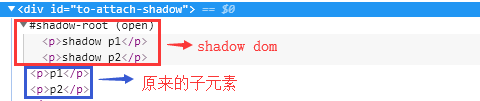

依附的这个dom树就是shadow dom，它的根节点叫**shadow root**，而它依附的元素(这里的div)叫**shadow host**：

```javascript
div.shadowRoot === shadowRoot // true
shadowRoot.host === div // true
```


那这里的渲染结果是什么？根据之前custom element中的例子，我们应该才到原来的内容被丢弃了，渲染出来的是shadow dom中的内容：

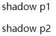

## Isolated DOM

这里我们通过`document.querySelectorAll`只能得到原来的两个p元素：

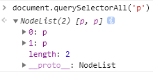

shadow dom中的内容没法通过正常途径查询出来，只能通过shadow root来查：

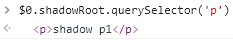

## 不是所有的元素都可以attach shadow dom

有些元素(如：textarea，video等)浏览器已经使用了shadow dom来实现了，你不能再加了；有些元素加shadow dom没有任何意义，如img。所以，只有部分元素可以添加shadow dom，当然这部分元素包含了所有合法的custom elements，参考[attachShadow](https://developer.mozilla.org/en-US/docs/Web/API/Element/attachShadow)查看具体哪些元素可以

# 内容分发与slot

我们把元素原来的子节点dom结构称为**light dom**，前面我们知道，默认情况下light dom是不会渲染出来的，最终的渲染结果完全由其上依附的shadow dom决定:

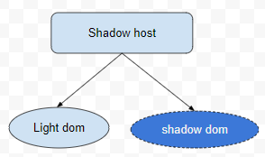

这样不是很灵活，有时候我们希望由组件的使用者和开发者共同决定最终的渲染内容，这就是**slot**的由来：我们可以在shadow dom里面指定一些slot(插槽)，用来接收来自light dom中的内容，例如：

```javascript
shadowRoot.innerHTML = `
  <p>shadow p1</p>
  <p>shadow p2</p>
  <slot></slot>
`;
```

上面的代码将整个light dom的内容插入到slot指定位置，渲染结果：

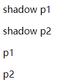

shadow dom结构：

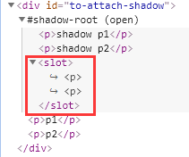

slot还可以指定`name`属性，然后在light dom中可以通过在元素上指定`slot=slotName`将对应元素渲染到指定的slot中，例如：

```javascript
shadowRoot.innerHTML = `
  <p>shadow p1</p>
  <slot name="slot1"></slot>
  <p>shadow p2</p>
  <slot></slot>
`;
```

```html
  <div id="to-attach-shadow">
    <p slot="slot1">p1</p>
    <p>p2</p>
  </div>
```

渲染结果：

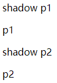

dom结构：

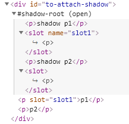

light dom中没有指定slot属性的都被渲染到默认的匿名slot中

# shadow dom样式

## scoped css

shadow dom内部的元素样式不受外部css影响，内部定义的css也只作用于内部的元素，不影响外部，你可以把shadow root看做是一个屏障，把shadow dom和外面隔开了。比如说我们在外面定义了样式：

```css
p {
  font-size: 200%;
  color: red;
}
```

这个样式只影响light dom，对shadow dom没有影响：

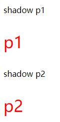

同理，我们在shadow dom内部定义了它自己的样式(外部的样式被删除了)，对外部元素的样式没有影响：

```javascript
shadowRoot.innerHTML = `
  <style>
    p {
      font-size: 20px;
      color: blue;
    }
  </style>
  <p>shadow p1</p>
  <slot name="slot1"></slot>
  <p>shadow p2</p>
  <slot></slot>
`;
```


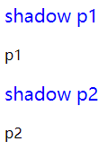

但是，shadow dom的样式还是受继承属性的影响，比如我们在body上面定义了一些继承属性，如`font-size`等，shadow dom也受这个影响:

```css
body {
  font-size: 20px;
  color: red;
}
```

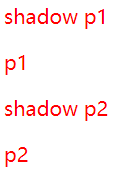

特别地，shadow dom的样式从shadow host继承，受host元素样式的影响，把上面的body换成div同样成立

## 从shadow dom内部控制host的样式

我们可以在shadow dom内部利用下面三个selector选中其所在的host元素：

- :host

  无条件选中host

- :host(selector)

  只有满足`selector`的host才被选中

- :host-context(selector)

  只有其本身或其祖先节点满足`selector`的host才被选中，是`:host(selector)`的超集

利用这些选择器，我们可以在shadow dom内部控制host的样式，如：

```javascript
shadowRoot.innerHTML = `
  <style>
    :host {
      color: red;
    }

    p {
      color: blue;
    }
  </style>
  <p>shadow p1</p>
  <slot name="slot1"></slot>
  <p>shadow p2</p>
  <slot></slot>
`;
```

结果如下：

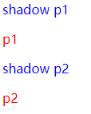

我们在host元素(即这里的div)上设置了`color: red`，所以light dom中的p元素都是红色；在shadow dom内部还重新定义了p的样式：`color: blue`，覆盖了从host元素继承的样式，所以shadow dom内部的p是蓝色。

## 从shadow dom内部控制light dom的样式

从上一节可以看到，light dom样式完全不受shadow dom内部样式影响，我们可以想象成*light dom以外部样式渲染好了之后再插入到shadow dom的slot处*。浏览器提供了一种机制：在light dom中的元素插入到slot处时，可以继续对它(已经使用外部样式渲染好了)追加一些样式：

```javascript
shadowRoot.innerHTML = `
  <style>
    :host {
      color: red;
    }

    ::slotted(p) {
      font-size: 30px;
    }
  </style>
  <p>shadow p1</p>
  <slot name="slot1"></slot>
  <p>shadow p2</p>
  <slot></slot>
`;
```

这使得light dom中的p元素的font-size变成30px：

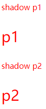

`::slotted(selector)`只能作用于顶层元素，例如这里只能选择p元素，而不能选择p元素的子元素(如果有的话)

## 外部host样式优先

对于host元素，我们既可以在外部也可以在内部添加样式，当发生冲突时，外部的样式优先

# 使用shadow dom来填充custom element

前面一直以普通的div元素来讲解shadow dom的机制，其实它的最佳拍档是custom element，一般来说，我们是在自定义元素的constructor中进行填充：

```javascript
export class HTMLClockElement extends HTMLElement {
  constructor() {
    super();
    // this.innerHTML = 'i am a clock custom element'
    const shadowRoot = this.attachShadow({ mode: 'open' });
    shadowRoot.innerHTML = `
      <style>
        ...
      </style>
      <p>from clock's shadow dom</p>
      <slot></slot>
    `;

    console.log('custom element created')
  }
}
```

使用：

```html
<x-clock>i am a clock</x-clock>
```

这样，`x-clock`就算得上一个真正的组件了，cool~

# 高级主题

有一些高级主题这里就不详细介绍了，大家碰到时可以参考google文档：https://developers.google.com/web/fundamentals/web-components/shadowdom#advanced

其中最重要的是shadow dom的[事件模型](https://developers.google.com/web/fundamentals/web-components/shadowdom#advanced)：发生在shadow dom内部的事件如何处理