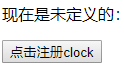
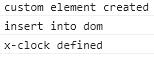
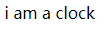
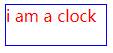

**web component**是html5原生的组件机制，它由四个标准组成：

1. custom element
2. shadow dom
3. html template
4. html import

这些标准可以单独使用，也可以结合在一起使用，今天先介绍一下`custom element`，后面会依次介绍其他几个

# native elements与custom elements

html文档由很多基本元素组成，如`div`, `span`, `ul`等等，我们可以称这些已经存在的元素为`native elements(本地元素)`。每一种本地元素都有一个class与之对应，如`div`对应`HTMLDivElement`, `span`对应`HTMLSpanElement`，`ul`对应`HTMLUListElement`，这些class都是从`HTMLElement`继承下来

一个自然而然的想法是：我们能否创建一些自定义元素并使用自定义标签呢？如：

```html
<my-tag></my-tag>
```

答案是可以，这就是**custom elements**的由来

# 创建一种自定义元素

要创建一种自定义元素，我们首先要准备一个class，就像本地的`HTMLDivElement`一样，从`HTMLElement`继承，用来定义元素的内在行为，假设我们要创建一个表示时钟的元素，我们可以这样做：

```javascript
class HTMLClockElement extends HTMLElement {
  constructor() {
    super();
    ...
  }
}
```

像`div`一样我们还需要指定这个元素对应的标签名，这样我们就能直接在html语言中使用这个元素了，我们把这个动作叫**注册自定义元素**：

```javascript
customElements.define('x-clock', HTMLClockElement);
```

```html
<x-clock></x-clock>
```

关于元素的标签名需要注意的是：

- 它们必须包含短横线(-)，这样浏览器在解析的时候才能将它们和本地元素区分开来
- 在使用的时候不能自包含(self-closing:`<x-clock/>`)，必须使用结束标签

# 钩子函数

在自定义元素的生命周期中有一些钩子(lifecycle hooks)，我们可以在其中做一些适当的响应处理：

| Name                                                 | 调用时机(Called when)                                        |
| ---------------------------------------------------- | ------------------------------------------------------------ |
| `constructor`                                        | An instance of the element is created or [upgraded](https://developers.google.com/web/fundamentals/web-components/customelements#upgrades). Useful for initializing state, settings up event listeners, or [creating shadow dom](https://developers.google.com/web/fundamentals/web-components/customelements#shadowdom). See the [spec ](https://html.spec.whatwg.org/multipage/scripting.html#custom-element-conformance)for restrictions on what you can do in the `constructor`. |
| `connectedCallback`                                  | Called every time the element is inserted into the DOM. Useful for running setup code, such as fetching resources or rendering. Generally, you should try to delay work until this time. |
| `disconnectedCallback`                               | Called every time the element is removed from the DOM. Useful for running clean up code. |
| `attributeChangedCallback(attrName, oldVal, newVal)` | Called when an [observed attribute](https://developers.google.com/web/fundamentals/web-components/customelements#attrchanges) has been added, removed, updated, or replaced. Also called for initial values when an element is created by the parser, or [upgraded](https://developers.google.com/web/fundamentals/web-components/customelements#upgrades). **Note:** only attributes listed in the `observedAttributes` property will receive this callback. |
| `adoptedCallback()`                                  | The custom element has been moved into a new `document` (e.g. someone called `document.adoptNode(el)`). |

`constructor`,`connectedCallback`,`disconnectedCallback`都很好理解，我们说下`attributeChangedCallback`和`adoptedCallback`：

- `attributeChangedCallback`

  在使用元素的时候我们经常要指定一些属性，不同的元素需要指定不同的属性，如`img`元素有`src`属性，`input`元素有`disabled`, `value`等属性，这些都是浏览器内置的。作为自定义元素的作者，我们需要决定元素需要哪些属性供使用者使用，如：

  ```html
  <x-clock disabled hour="4" minute="30" second="0"></x-clock>
  ```

  在这些属性中，我们可以指定哪些属性的变化可以被监控到，通过`observedAttributes`函数指定：

  ```javascript
  // 指定需要观察的属性
  static get observedAttributes() {
    return ['disabled'];
  }
  ```

  这样，当`disabled`属性被修改或移除(`setAttribute,remoteAttribute`)时，`attributeChangedCallback`将被**同步**调用

- `adoptedCallback`

  当元素从当前文档移到另一个文档时被调用，移动的方式是[document.adoptNode](https://developer.mozilla.org/en-US/docs/Web/API/Document/adoptNode)

# 自定义元素的"升级"(upgrade)

我们可以在自定义元素被注册之前就使用它：

```html
<x-clock></x-clock>
```

这个时候系统知道这些元素是自定义元素，但是是未定义的(`undefined`)，我们可以在后面再使用`customElements.define`来注册它，一旦被注册，这些未定义的元素就自动"升级(upgrade)"。

我们可以使用`customElements.whenDefined`来得知一个元素什么时候被定义了：

```javascript
customElements.whenDefined('x-clock').then(() => {
  console.log('x-clock defined');
});
```

我们来测试一下，页面如下：

```html
  <p>现在是未定义的：</p>
  <button id="reg">点击注册clock</button>
  <x-clock></x-clock>
  <script src="main.mjs" type="module"></script>
```



```javascript
// clock.mjs
export class HTMLClockElement extends HTMLElement {
  constructor() {
    super();
    this.innerHTML = 'i am a clock custom element'
    console.log('custom element created')
  }

  // 指定需要观察的属性
  static get observedAttributes() {
    return ['disabled'];
  }

  connectedCallback() {
    console.log('insert into dom')
  }

  disconnectedCallback() {
    console.log('removed from dom')
  }

  attributeChangedCallback(attrName, oldVal, newVal) {
    console.log(`${attrName} changed from ${oldVal} to ${newVal}`)
  }

  adoptedCallback() {
    console.log('move to new document')
  }
}
```

```javascript
// main.mjs
import { HTMLClockElement } from './clock.mjs'

document.getElementById('reg').addEventListener('click', (e) => {
  customElements.define('x-clock', HTMLClockElement);
})

customElements.whenDefined('x-clock').then(() => {
  console.log('x-clock defined');
});
```

刚开始的时候自定义元素没有注册，虽然我们使用了它，但是控制台没有任何打印任何信息，元素内容也没有渲染出来；当我们点击按钮时，元素被注册，内容也渲染出来了：




# 自定义元素的展示

## 内容

自定义元素默认是空的，没有内容也没有样式，这显然没啥卵用，我们第一步先填充点内容，最简单的方式是直接在标签里面指定内容，就像普通的`div`元素一样：

```html
<x-clock>i am a clock</x-clock>
```



这个时候自定义元素的内容完全取决于使用者，一般我们是不会这样做的，因为使用自定义元素(进而是web component)就是为了封装，所以一般是自己控制里面的内容。

可以在`constructor`中直接设置`innerHTML`属性(注意：在`constructor`中能做的事有一定的限制[spec](https://html.spec.whatwg.org/multipage/custom-elements.html#custom-element-conformance))：

```javascript
	constructor() {
    super();
    this.innerHTML = 'i am a clock'
    console.log('custom element created')
  }
```

## 样式

自定义标签和其他标签一样，可以为它设置任何样式，如：

```css
x-clock {
  display: block;
  width: 100px;
  height: 40px;
  margin-top: 10px;
  color: red;
  border: 1px solid blue;
}
```

效果：



为了更好地控制元素注册前后的展示效果，我们可以利用`:defined`伪类，它可以用来选取一定注册了的自定义元素，所以我们可以给未注册的元素单独设置样式：

```css
x-clock:not(:defined) {
  opacity: 0;
}
```

# 总结

自定义元素作为web component的重要组成部分，使得我们可以定制新的标签，标签中的内容由自己定义，有一定的封装作用。但是一旦元素被渲染出来，它和其他内置元素完全一样：里面的dom结构完全暴露在外面(通过document.queryBy***直接获取)，它的内部dom样式也会受外部css的影响，这离我们想要的组件封装还有一定的距离。

web component另一个组成部分是shadow dom，它就是来解决上面提到的封装问题的，后面会单独讲

