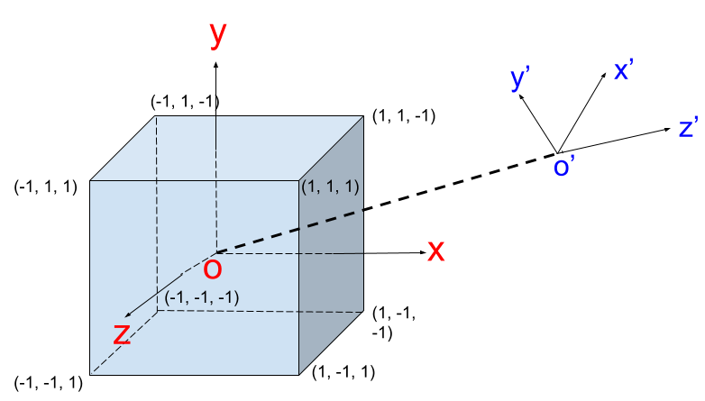
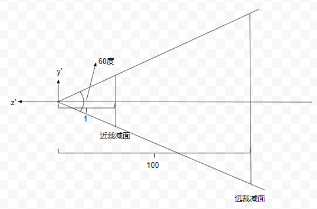
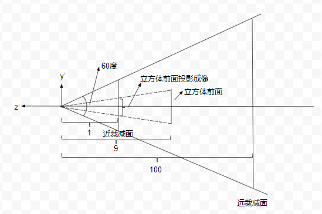
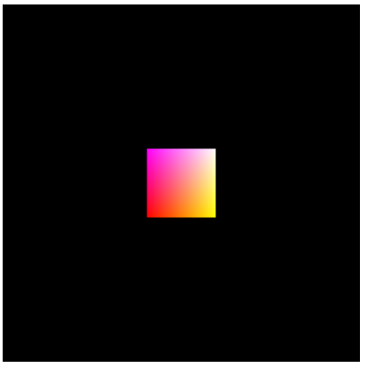

我们知道，在计算机图形学中物体从建模到展示在屏幕上需要经过大概下面几个坐标变换：


我们以一个立方体的绘制来说明这一过程

## 建模

这一步很简单，我们的立方体中心位于坐标系原点，默认情况下，相机也摆放在坐标系原点，和立方体处于同一个坐标系中，且使用的是右手坐标系：


## 摆放相机

立方体建好之后第二个问题就是从哪个方向来观察它，也就是相机的摆放。默认情况下相机位于原点，也就是立方体的中心，且是往Z轴的负方向进行观察，这个时候我们只能看到立方体的后面一面。为了便于观察，我们需要调整相机的位置。我们可以想象相机上面固定住xyz坐标轴，相机移动时，坐标轴也跟着移动。相机摆放完之后，我们要重新计算立方体在新的坐标系下的坐标，观察方向不变，还是沿着新的Z轴负方向：



已知原坐标系原点（O）、新坐标系原点（O'），及新坐标系y轴向量，就可以唯一确定这个变换，我们可以用一个函数调用表示：

```javascript
// 新原点：(nOx, nOy, nOz), y轴向量：(upx, upy, upz)
lookAt(nOx, nOy, nOz, 0, 0, 0, upx, upy, upz)
```

我们把`lookAt`确定的矩阵记为`Mv`,则立方体在新的相机坐标系下的坐标为：

```javascript
np = Mv * p
```

## 投影并裁减

为了清除地看到投影后的图形，我们考虑一种简单的投影情况：相机沿着原Z轴正方向移动10个单位：

```javascript
lookAt(0, 0, 10, 0, 0, 0, 0, 1, 0)
```


我们以新的原点为聚焦点做透视投影，以上下裁减面夹角、近裁减面宽高比、近远裁减面距离指定透视投影参数：



```javascript
setPerspective(60, 1, 1, 100)
```

大家想想，这个时候我们的立方体在哪里呢？移动相机之后，立方体的前面的z坐标应该变成1 - 10 = 9，而后面的z坐标是-1 - 10 = -11，下面我们就看看经过这个投影之后，立方体前面在近裁减面上的投影位置及大小，通过简单作图可以看到：



可以看出立方体前面的成像高度为`1/9`，而近裁减面的高度为`tan(30)`，即$\sqrt{3}/3$，所以成像高度与近裁减面的高度比为：$\sqrt{3}/9$。

## 输出到视口

到最后一步了，我们假设视口是一个`400x400`的窗口，在WebGL中，即一个canvas：

```html
<canvas id="webgl" width="400" height="400">
  Please use a browser that supports "canvas"
</canvas>
```

我们需要把近裁减面映射到这个canvas，按照前面的推算，我们可以得到立方体的前面最终渲染到这个canvas上的高度为$\sqrt{3}/9*400$，大概为77个像素，最终的渲染结果如下：



黑色背景即为整个canvas，通过手动测量，确实是77个像素，说明以上的推算过程是正确的，完整的示例在[这里](../webgl-guide/ch07/HelloCube.html)。